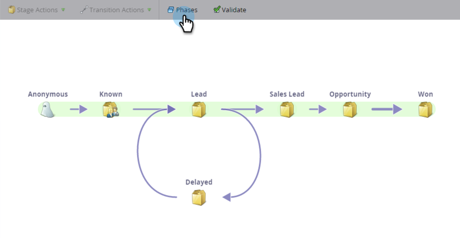

# Noções básicas sobre as fases do modelo de receita {#understanding-revenue-model-phases}

As fases são uma maneira de agrupar vários estágios. Às vezes, vários estágios em um modelo refletem uma fase de um funil.

## Definir as fases do modelo {#define-the-phases-of-the-model}

1. Clique em **[!UICONTROL Fases]**.

   

1. Clique no botão azul para arrastar as fases para cima e para baixo pelos estágios.

   
