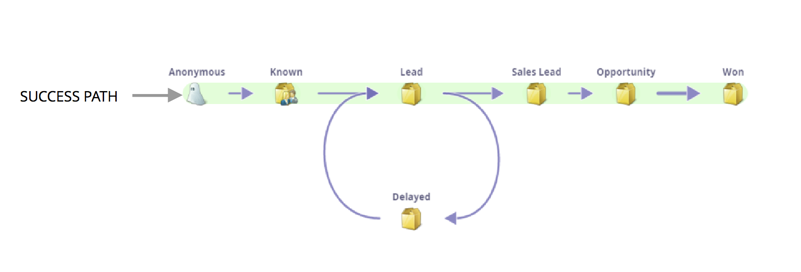

# Noções básicas sobre o caminho de sucesso do modelo de receita {#understanding-revenue-model-success-path}

## Caminho de sucesso {#success-path}

No modelo, o caminho verde também conhecido como **Caminho de Sucesso** é o caminho ideal de como um cliente potencial faz a transição linear para um negócio fechado/conquistado.

Exemplo de estágios em um caminho de sucesso:

| **NOME DO ESTÁGIO DO CAMINHO DE SUCESSO** | **DEFINIÇÃO** |
|---|---|
| **Revisar Novos Nomes** | Revisar se novos nomes são qualificados |
| **Prospecto** | Clientes potenciais qualificados que ainda não estão prontos para vendas |
| **Lead** | Clientes potenciais qualificados de marketing (&quot;prontos para vendas&quot;) |
| **Oportunidade** | Clientes potenciais aceitos pelas vendas, trabalhando ativamente |
| **Cliente** | Transações conquistadas fechadas |

>[!TIP]
>
>Verde é por dinheiro. Tudo no caminho do verde está no caminho do sucesso! É por isso que há apenas setas verdes no [Analisador de caminho de sucesso](using-the-success-path-analyzer.md).

## Desvios {#detours}

Reconhecendo que nem todos os leads seguem um &quot;caminho de sucesso&quot; linear, você também deve definir seus &quot;estágios de desvio&quot; para capturar leads que não são qualificados ou que exigem algumas rodadas de carinho antes de se tornarem prontos. Por exemplo:

| **NOME DO ESTÁGIO DE DESVIO** | **DEFINIÇÃO** |
|---|---|
| **Desqualificado** | Nomes marcados como perfil não incluído |
| **Inativo** | Clientes potenciais que deixaram de responder |
| **Reciclado** | Qualificado, mas precisa de mais carinho (vinculado ao cliente potencial) |
| **Perdidas** | Perda de oportunidades (cuidados contínuos) |

>[!TIP]
>
>Eles não estão no caminho verde. Esses estágios não serão mostrados no Analisador de caminho de sucesso.

Ver como os leads fluirão no futuro será muito mais fácil! Diga olá para o seu novo amiguinho.
