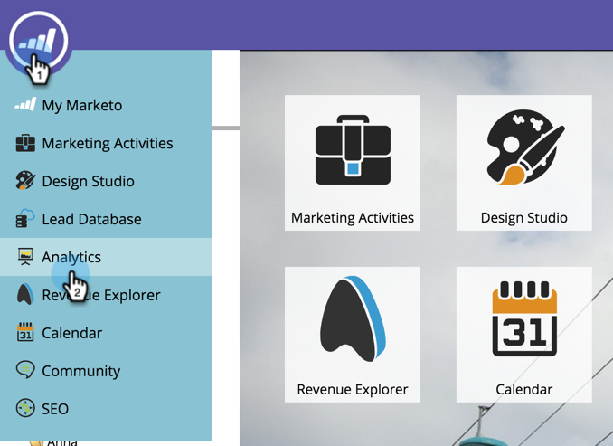

# Uso de estágios de portão do modelo de receita {#using-revenue-model-gate-stages}

Um estágio de porta serve como uma verificação de qualificação.

>[!TIP]
>
>É uma ótima ideia criar um modelo de prática em um programa de gráficos ou apresentação e confirmá-lo com seus colegas.

## Adicionar Um Estágio De Portão {#add-a-gate-stage}

1. Vá para a área **[!UICONTROL Analytics]**.

   

1. Selecione um modelo existente ou [crie um novo](/help/marketo/product-docs/reporting/revenue-cycle-analytics/revenue-cycle-models/create-a-new-revenue-model.md).

   

1. Clique em **[!UICONTROL Editar rascunho]**.

   

1. Clique no botão **[!UICONTROL Portão]** e arraste e solte em qualquer lugar da tela.

   

1. Edite o **[!UICONTROL Nome]** e selecione um **[!UICONTROL Tipo]**.

   >[!NOTE]
   >
   >Selecione [[!UICONTROL Iniciar rastreamento por conta]](/help/marketo/product-docs/reporting/revenue-cycle-analytics/revenue-cycle-models/start-tracking-by-account-in-the-revenue-modeler.md) neste momento para adicionar o insight ao desempenho de suas contas à medida que elas avançam pelo modelo.

   

>[!NOTE]
>
>O Gate Stage divide os clientes em potencial com base nos critérios inseridos nas regras de transição; **ele não contém clientes em potencial**. Uma transição padrão é necessária para que clientes em potencial que não são escolhidos pelas outras transições acabem passando pelo padrão.

## Editar um Estágio de Portão {#edit-a-gate-stage}

Edite o [!UICONTROL Nome], [!UICONTROL Descrição] e ajuste o [!UICONTROL Tipo] do estágio de Porta. Você também pode optar por [[!UICONTROL Iniciar rastreamento por conta]](/help/marketo/product-docs/reporting/revenue-cycle-analytics/revenue-cycle-models/start-tracking-by-account-in-the-revenue-modeler.md).

1. Clique em um ícone de estágio **[!UICONTROL Portão]**.

   

1. Clique nos campos **[!UICONTROL Nome]** e **[!UICONTROL Descrição]** para editar seu conteúdo.

   

1. Selecione o menu suspenso **[!UICONTROL Type]** para editar.

   

## Excluir Um Estágio De Portão {#delete-a-gate-stage}

1. Você pode excluir um Gate Stage clicando com o botão direito do mouse no ícone de Gate stage e selecionando **[!UICONTROL Excluir]**.

   

1. Você também pode excluir um estágio de Portão clicando nele e, no menu suspenso **[!UICONTROL Ações de Estágio]**, selecionando **[!UICONTROL Excluir]**.

   

1. Ambos os métodos de exclusão pedem que você confirme sua escolha. Clique em **[!UICONTROL Excluir]**.

   

Parabéns! Agora você entende o maravilhoso mundo de Gate Stages.

>[!MORELIKETHIS]
>
>* [Usando Estágios De Inventário De Modelo De Receita](/help/marketo/product-docs/reporting/revenue-cycle-analytics/revenue-cycle-models/using-revenue-model-inventory-stages.md)
>* [Usando Estágios do SLA de Modelo de Receita](/help/marketo/product-docs/reporting/revenue-cycle-analytics/revenue-cycle-models/using-revenue-model-sla-stages.md)
>* [Criar um Novo Modelo de Receita](/help/marketo/product-docs/reporting/revenue-cycle-analytics/revenue-cycle-models/create-a-new-revenue-model.md).
