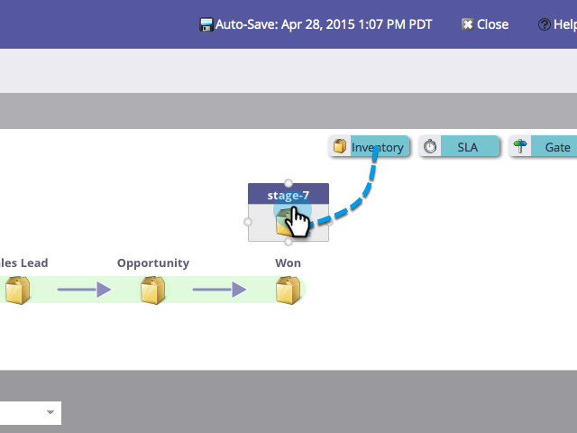

# Uso de estágios de inventário do modelo de receita {#using-revenue-model-inventory-stages}

Todos os clientes em potencial e contas conhecidos residem inicialmente no Estágio de inventário. Esse pool de clientes potenciais é onde os clientes potenciais são estimulados até que estejam prontos para vendas. Não há limite de tempo em um estágio do inventário.

>[!TIP]
>
>É uma ótima ideia criar um modelo de prática em um programa de gráficos ou apresentação e confirmá-lo com seus colegas primeiro.

## Adicionar Um Estágio De Inventário {#add-an-inventory-stage}

1. Para adicionar um novo estágio de Inventário de Modelo de Ciclo de Receita, clique no botão **[!UICONTROL Analytics]** na tela inicial do **[!UICONTROL My Marketo]**.

   

1. Na seção **[!UICONTROL Analytics]**, selecione seu modelo existente ou [crie um novo](/help/marketo/product-docs/reporting/revenue-cycle-analytics/revenue-cycle-models/create-a-new-revenue-model.md).

   

1. Clique em **[!UICONTROL Editar rascunho]**.

   

1. Para adicionar um novo estágio do inventário, clique no botão **[!UICONTROL Inventário]** e arraste e solte em qualquer lugar da tela.

   

1. Você pode editar o **[!UICONTROL Nome]**, adicionar uma **[!UICONTROL Descrição]** e ajustar o **[!UICONTROL Tipo]** após adicionar um estágio. Você também pode selecionar **[[!UICONTROL Iniciar rastreamento por conta]](/help/marketo/product-docs/reporting/revenue-cycle-analytics/revenue-cycle-models/start-tracking-by-account-in-the-revenue-modeler.md)** agora.

   

## Editar um estágio de inventário {#edit-an-inventory-stage}

Ao selecionar um ícone de Inventário, você pode editar o **[!UICONTROL Nome]**, adicionar uma **[!UICONTROL Descrição]** ou ajustar o **[!UICONTROL Tipo]**. Você também pode selecionar [[!UICONTROL Iniciar rastreamento por conta]](/help/marketo/product-docs/reporting/revenue-cycle-analytics/revenue-cycle-models/start-tracking-by-account-in-the-revenue-modeler.md).

1. Clique no ícone de **[!UICONTROL Inventário]**.

   

1. Clique nos campos **[!UICONTROL Nome]** e **[!UICONTROL Descrição]** para editar seu conteúdo.

   

1. Selecione o menu suspenso **[!UICONTROL Tipo]** para editar.

   

## Excluir Um Estágio De Inventário {#delete-an-inventory-stage}

1. Você pode excluir um Estágio de inventário clicando com o botão direito do mouse ou com o controle clicando em um ícone de estágio de inventário.

   

1. Você também pode excluir um estágio clicando nele e, na lista suspensa **[!UICONTROL Ações de Estágio]**, selecione **[!UICONTROL Excluir]**.

   

1. Ambos os métodos de exclusão pedem que você confirme sua escolha. Clique em **[!UICONTROL Excluir]**.

   

Parabéns! Agora você entende o maravilhoso mundo dos Estágios de Inventário.
