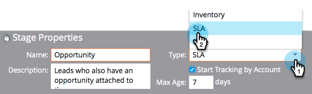

# Usando Estágios de SLA de Modelo de Receita {#using-revenue-model-sla-stages}

SLA significa &quot;contrato de nível de serviço&quot;. Essas etapas são usadas quando há um tempo máximo definido no qual um cliente potencial precisa ser avaliado ou processado antes de avançar ou sair do processo.

>[!TIP]
>
>É uma ótima ideia criar um modelo de prática em um programa gráfico ou de apresentação e confirmá-lo com seus colegas.

## Adicionar uma Etapa do SLA {#add-an-sla-stage}

1. Para adicionar uma nova etapa do SLA do modelo do ciclo de receita, clique no botão **Analytics** na tela inicial Meu marketing.

   

1. Na seção Analytics, selecione o modelo existente ou [crie um novo](create-a-new-revenue-model.md).

   

1. Clique em **Editar rascunho**.

   

1. Para adicionar uma nova etapa do SLA, clique no botão **SLA** e arraste e solte para qualquer lugar na tela.

   

1. Você pode editar o **Nome**, adicionar uma **Descrição** e ajustar o **Tipo** após adicionar uma etapa. Você também pode selecionar ** Rastreamento de [Start por conta](start-tracking-by-account-in-the-revenue-modeler.md)** neste momento.

   

## Editar um estágio de SLA {#edit-an-sla-stage}

Ao selecionar um ícone de estágio SLA, você pode editar o Nome, adicionar uma Descrição e ajustar o Tipo. Você também pode selecionar Rastreamento de [Start por conta](start-tracking-by-account-in-the-revenue-modeler.md).

1. Clique no ícone de estágio SLA.

   

1. Clique nos campos **Nome** e **Descrição** para editar seu conteúdo.

   

1. Selecione o menu suspenso **Tipo** para editar.

   

## Excluir uma Etapa do SLA {#delete-an-sla-stage}

1. Você pode excluir um SLA Stage clicando com o botão direito do mouse ou controlando o clique em um ícone de SLA stage.

   

1. Você também pode excluir uma etapa clicando nela e, em seguida, na lista suspensa Ações da etapa, selecione Excluir.

   

