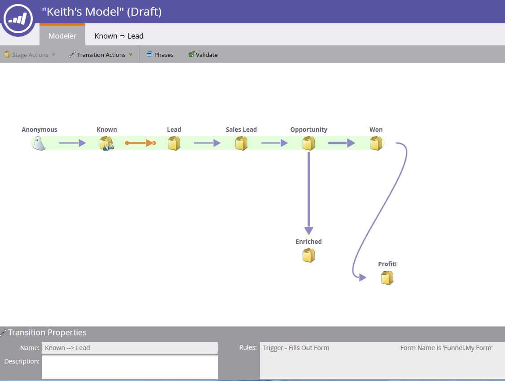
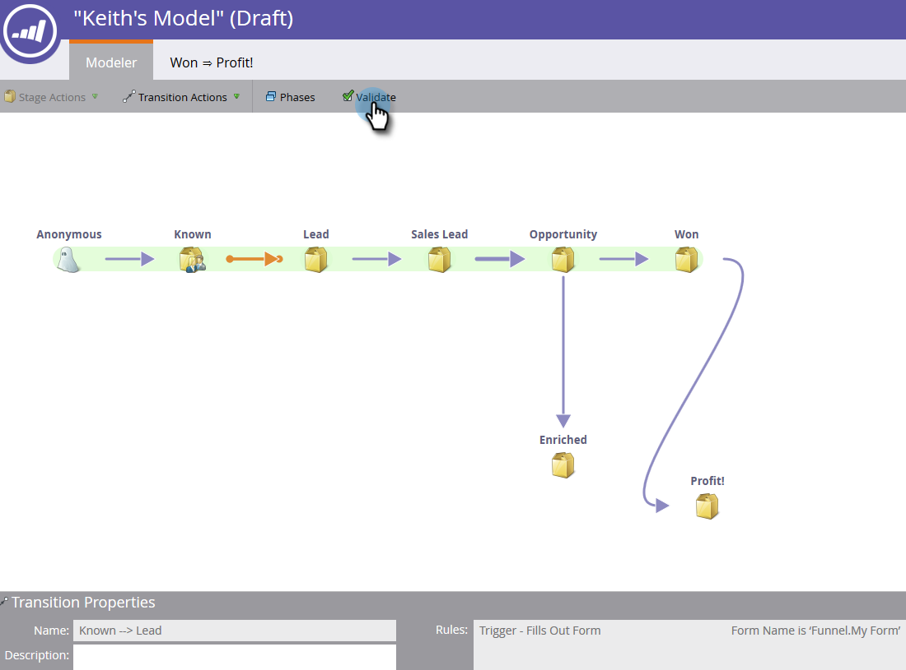

# Uso de transições do modelo de receita {#using-revenue-model-transitions}

>[!PREREQUISITES]
>
>[Criar um Novo Modelo de Receita](/help/marketo/product-docs/reporting/revenue-cycle-analytics/revenue-cycle-models/create-a-new-revenue-model.md)

Ao criar seu modelo e selecionar e organizar seus estágios de inventário, é hora de definir as transições.

1. Clique com o botão direito do mouse (você também pode clicar duas vezes) em uma das setas para começar e selecione **[!UICONTROL Editar transição]**.

   

   >[!NOTE]
   >
   >Regras de transição &#39;[!UICONTROL Anônimo] ^ [!UICONTROL Conhecido]&#39; não podem ser editadas.

1. Uma nova guia será aberta para a transição selecionada.

   

1. As transições controlam como os leads se movem entre estágios. Arraste o acionador (ou filtro) de sua escolha da direita e solte-o em qualquer lugar na tela de desenho. Neste exemplo, selecionaremos o acionador **[!UICONTROL Preencher formulário]**.

   >[!TIP]
   >
   >Como o modelador de receita está configurando você para relatórios, recomenda-se que as transições sempre incluam acionadores. Dessa forma, seus relatórios refletirão a verdadeira velocidade do fluxo do modelo/estágio. Filtros podem ser adicionados com os acionadores para restrições adicionais.

   

1. Escolha o(s) parâmetro(s) do acionador/filtro selecionado.

   

1. Para voltar ao seu modelo, clique em **[!UICONTROL Modeler]**.

   

1. Na parte inferior da tela, você verá as regras de transição.

   

1. Depois de configurar as regras para todas as transições, clique em **[!UICONTROL Validar]** para verificar.

   

1. Se feito corretamente, você verá a seguinte mensagem.

   

Muito bem! Você modificou com êxito as transições de modelo.

>[!MORELIKETHIS]
>
>[Aprovar/Cancelar aprovação de um modelo de receita](/help/marketo/product-docs/reporting/revenue-cycle-analytics/revenue-cycle-models/approve-unapprove-a-revenue-model.md)
