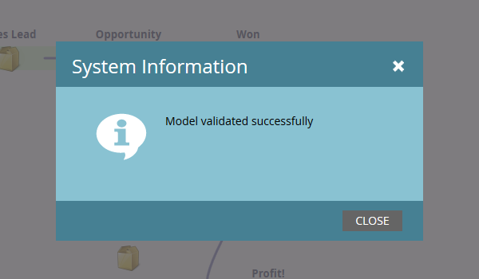

# Usando Transições de Modelo de Receita {#using-revenue-model-transitions}

>[!PREREQUISITES]
>
>[Criar um novo modelo de receita](create-a-new-revenue-model.md)

Ao criar o modelo e selecionar e organizar os estágios de inventário, é hora de definir as transições.

1. Clique com o botão direito do mouse (também é possível clicar com o duplo) em uma das setas para começar e selecione **Editar Transição**.

   

   >[!NOTE]
   >
   >As regras de transição &quot;Anônimo Conhecido&quot; não podem ser editadas.

1. Uma nova guia será aberta para a transição selecionada.   
1. As transições controlam como as vendas se movem entre os estágios. Arraste o acionador (ou filtro) de sua escolha da direita e solte em qualquer lugar na tela. Neste exemplo, selecionaremos o acionador Preencher formulário.

   >[!TIP]
   >
   >Como o modelador de receita está configurando você para o relatórios, recomenda-se que as transições sempre incluam acionadores. Dessa forma, seus relatórios refletirão a velocidade real do fluxo do modelo/estágio. Filtros podem ser adicionados com os acionadores para restrições adicionais.

   

1. Escolha os parâmetros para o seu acionador/filtro selecionado.

   

1. Para voltar ao seu modelo, clique em **Modelador**.

   

1. Na parte inferior da tela, você verá as regras de transição.

   

1. Depois de configurar as regras para todas as suas transições, clique em **Validar** para verificar.

   

1. Se concluído corretamente, você verá a seguinte mensagem.

   

Muito bem! As transições de modelo foram modificadas com êxito.

>[!NOTE]
>
>**Artigos relacionados**
>
>[Aprovar/Cancelar aprovação de um modelo de receita](approve-unapprove-a-revenue-model.md)
