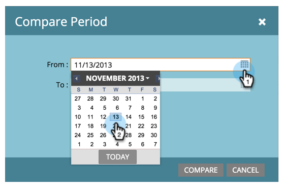

# Uso do Analisador de caminho de sucesso {#using-the-success-path-analyzer}

Use o Analisador de caminho de sucesso para explorar os detalhes específicos que refletem o fluxo (quantidade) e a velocidade (velocidade, em termos de dias) das pessoas durante os estágios de seu [Modelo do ciclo de receita](/help/marketo/product-docs/reporting/revenue-cycle-analytics/revenue-cycle-models/understanding-revenue-models.md).

>[!PREREQUISITES]
>
>[Criar um Analisador de caminho bem-sucedido](/help/marketo/product-docs/reporting/revenue-cycle-analytics/revenue-cycle-models/create-a-success-path-analyzer.md)

1. Ir para **Analytics** e selecione seu **Analisador de caminho bem-sucedido**.

   

   O gráfico à direita reflete os dados no botão selecionado à esquerda. Por padrão, é Saldo.

1. Clique em **Em fluxo** para registrar o número de pessoas que entraram no palco durante o período selecionado.

   

   * Clique em Fluxo de saída para criar um gráfico de quantas pessoas saíram do palco.
   * Clique em Conv % para fazer o gráfico da taxa de conversão desta etapa para a próxima etapa.
   * Clique em Tempo médio para ver quanto tempo as pessoas passaram neste estágio antes de passar para o próximo estágio.

1. Clique em **Ações do gráfico** > Comparar período para comparar os dados com um intervalo de tempo diferente e com comprimento igual.

   

1. Selecione o **De** data do período de comparação.

   

   O **Para** é automaticamente definida para corresponder à duração do período original.

1. Clique em **Comparar**.

   

1. O gráfico é atualizado com dados sobrepostos para o período de comparação, em verde.

   

1. Para alterar a escala de tempo do gráfico, clique em uma das **Gráfico por** botões: diariamente (padrão), semanalmente e mensalmente

   

1. Para palcos com SLAs (Service-Level Agreements, contratos de nível de serviço), clique em **Ações do gráfico** > **Mostrar SLA Vencido** para mostrar todas as pessoas que já perderam um destino de SLA dentro do intervalo de tempo especificado.

   

1. O gráfico é atualizado para refletir quantos SLAs devem estar em cada nó, em laranja.

   

   As pessoas mostradas em laranja podem *ou podem não* ainda estará no estágio de SLA.

1. Clique em **Ações do gráfico** > **Mostrar SLA Vencida** para mostrar todas as pessoas com alvos de SLA expirados que ainda estejam no estágio de SLA no final do período de tempo especificado.

   

1. O gráfico é atualizado para refletir quantos SLAs estavam vencidos em cada nó, em laranja.

   

1. Para ler os detalhes específicos de um ponto de dados em um nó específico (data), passe o mouse sobre a bolha.

   

1. Para imprimir o gráfico, clique em **Ações do gráfico** > **Imprimir Gráfico**.

   

O analisador está aqui para ajudá-lo a entender o movimento através do seu modelo. À medida que você se torna mais avançado, isso se tornará realmente importante para estrategizar seus esforços de marketing.
