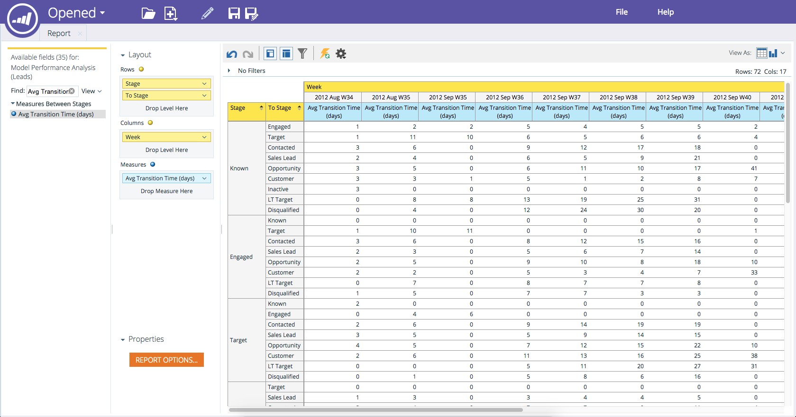

# Adicionando Campos a um Relatório do Explorador de Receita {#adding-fields-to-a-revenue-explorer-report}

Personalize relatórios do explorador de receita arrastando e soltando campos de dimensão e métrica na tela.

<table> 
 <tbody> 
  <tr> 
   <th>Tipo de campo</th> 
   <th>Descrição</th> 
  </tr> 
  <tr> 
   <td>Campo ou Dimension amarelo</td> 
   <td>
Campos amarelos são as dimensões (linhas e colunas) do seu relatório.

Por exemplo, você pode configurar um relatório que mostre o status do lead ou a data de criação em colunas.
</td> 
  </tr> 
  <tr> 
   <td>Campo ou medida azul</td> 
   <td>
Campos azuis são métricas analisadas em seus dados.

Por exemplo, essa pode ser a pontuação de lead média para seus leads, ou o número de dias em que um lead teve uma oportunidade.
</td> 
  </tr> 
 </tbody> 
</table>

1. Localize os campos amarelos que deseja usar e arraste-os para Linhas.

   

   >[!TIP]
   >
   >Passe o mouse sobre um campo para obter uma descrição completa.

1. Localize os campos azuis que deseja usar e arraste-os para Medidas.

   

   Ótimo! Agora você tem um relatório completo!

   

>[!MORELIKETHIS]
>
>[Excluindo um Campo em um Relatório do Explorador de Receita](/help/marketo/product-docs/reporting/revenue-cycle-analytics/revenue-explorer/deleting-a-field-in-a-revenue-explorer-report.md)
