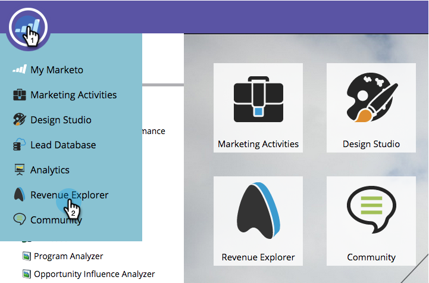

# Criar um relatório do Gerenciador de receita {#create-a-revenue-explorer-report}

O relatório Explorador de receita permite rastrear o ROI em suas iniciativas de marketing.

>[!AVAILABILITY]
>
>Nem todos os usuários do Marketo Engage compraram essa funcionalidade. Entre em contato com a equipe de conta do Adobe (seu gerente de conta) para obter mais detalhes.

>[!IMPORTANT]
>
>A pasta Lixeira no Gerenciador do Ciclo de Receita foi ocultada temporariamente devido a um erro. No momento, estamos trabalhando em uma correção e seus arquivos estão seguros. Contate [Suporte para Adobe](https://nation.marketo.com/t5/support/ct-p/Support) se houver arquivos que você precise restaurar.

1. Vá para a **Gerenciador de Receita** área.

   

1. Clique em **Criar novo** e selecione **Relatório**.

   

1. Escolha um tipo de relatório.

   

   Ótimo! Você criou oficialmente um relatório. Hora de personalizar adicionando alguns campos!

   

>[!MORELIKETHIS]
>
>[Adicionar campos a um relatório do Gerenciador de receita](/help/marketo/product-docs/reporting/revenue-cycle-analytics/revenue-explorer/adding-fields-to-a-revenue-explorer-report.md)
>[Adição de Medidas Personalizadas a um Relatório do Gerenciador de Receita](/help/marketo/product-docs/reporting/revenue-cycle-analytics/revenue-explorer/adding-custom-measures-to-a-revenue-explorer-report.md)
