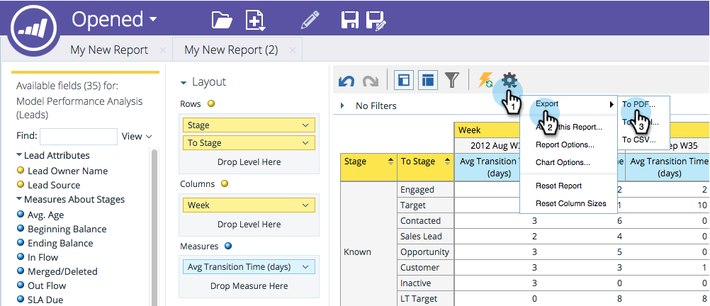

# Exportando um relatório do [!UICONTROL Gerenciador de Receita] {#exporting-a-revenue-explorer-report}

Você pode exportar qualquer relatório do explorador de receita e compartilhá-lo com qualquer pessoa.

1. Clique no ícone de engrenagem, selecione **[!UICONTROL Exportar]** e selecione um formato de arquivo.

   

   >[!NOTE]
   >
   >É possível exportar um relatório para os três formatos a seguir:
   >
   >* PDF
   >* [!DNL Excel]
   >* CSV

1. Selecione o **[!UICONTROL Formato de Página]** e a **[!UICONTROL Orientação]** desejados e clique em **[!UICONTROL Exportar]**.

   

   Doce! Envie esse arquivo e impressione seus colegas com suas habilidades de marketing semelhantes ao ninja.

>[!MORELIKETHIS]
>
>[Assinar um [!UICONTROL Relatório do Gerenciador de Receitas]](/help/marketo/product-docs/reporting/revenue-cycle-analytics/revenue-explorer/subscribe-to-a-revenue-explorer-report.md)
