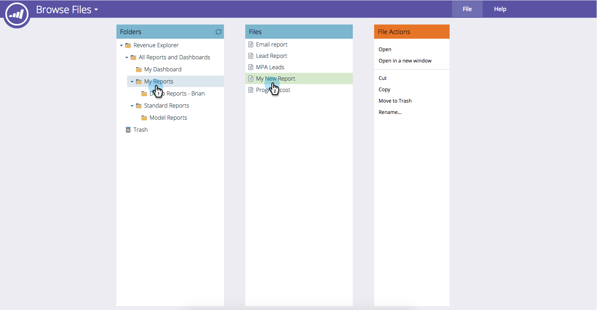

# Salvando um Relatório do [!UICONTROL Gerenciador de Receita] {#saving-a-revenue-explorer-report}

Os relatórios do [!UICONTROL Revenue Explorer] podem ser salvos no arquivo de sua escolha.

1. Clique no ícone Salvar.

   

   >[!NOTE]
   >
   >As alterações feitas no relatório não são salvas automaticamente. Portanto, salve com frequência!

1. Dê um nome descritivo ao relatório, selecione um local e clique em **[!UICONTROL Salvar]**!

   

   Isso é tudo! Agora você pode acessar seu arquivo em **[!UICONTROL Procurar Arquivos]**.

   

>[!MORELIKETHIS]
>
>[Assinar um [!UICONTROL Relatório do Gerenciador de Receitas]](/help/marketo/product-docs/reporting/revenue-cycle-analytics/revenue-explorer/subscribe-to-a-revenue-explorer-report.md)
