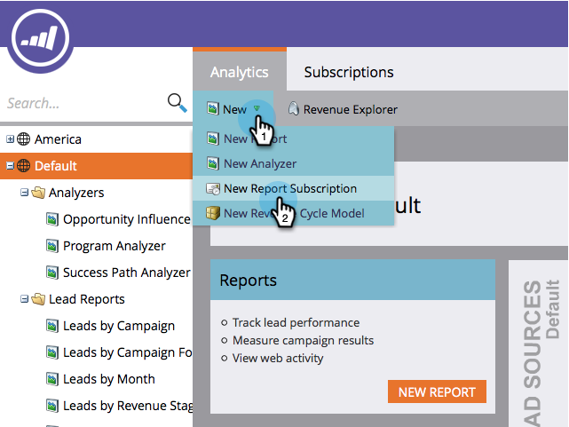

# Assinar um Relatório do Gerenciador de Receita {#subscribe-to-a-revenue-explorer-report}

Para receber atualizações de seus relatórios do Revenue Cycle Explorer e compartilhá-las, você pode inscrever qualquer endereço de email em um relatório existente.

1. Vá para **Analytics** e selecione **Novo** > **Nova Assinatura de Relatório**.

   

   >[!NOTE]
   >
   >Para se inscrever em um relatório básico criado em um programa, consulte [Assinar um Relatório Básico.](/help/marketo/product-docs/reporting/basic-reporting/report-subscriptions/subscribe-to-a-basic-report.md)

1. Para **Report Source**, selecione **Explorador de Receita**.

   

1. Navegue até a árvore de pastas e selecione o relatório.

   

1. Insira o(s) endereço(s) de email e defina a frequência dos emails do relatório.

   

   >[!NOTE]
   >
   >Qualquer pessoa pode cancelar a inscrição no relatório por meio do email recebido.

1. Sua assinatura está configurada. Se você incluiu seu próprio endereço de email, receberá o relatório por email.

   

>[!MORELIKETHIS]
>
>Saiba como [gerenciar todas as suas assinaturas de relatórios](/help/marketo/product-docs/reporting/basic-reporting/report-subscriptions/manage-report-subscriptions.md) em um único local.
