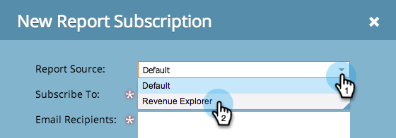

# Inscrever-se em um Relatório do Gerenciador de Receita {#subscribe-to-a-revenue-explorer-report}

Para receber atualizações dos relatórios do [Revenue Cycle Explorer](http://docs.marketo.com/display/docs/revenue+cycle+analytics) e compartilhá-las, você pode assinar qualquer endereço de email para um relatório existente.

1. Vá para **Analytics** e selecione **Novo > Nova Subscrição de relatório.**

   

   >[!NOTE]
   >
   >Para assinar um relatório básico criado em um programa, consulte [Assinar um Relatório básico.](../../../../product-docs/reporting/basic-reporting/report-subscriptions/subscribe-to-a-basic-report.md)

1. Para Fonte **do** relatório, selecione** Revenue Explorer**.

   

1. Navegue pela árvore de pastas e selecione o relatório.

   

1. Insira os endereços de email e defina a frequência dos emails do relatório.

   

   >[!NOTE]
   >
   >Qualquer pessoa pode cancelar a inscrição no relatório por email recebido.

1. Sua subscrição está pronta! Se você incluiu seu próprio endereço de email, você receberá o relatório por email.

   

>[!MORELIKETHIS]
>
>Saiba como [gerenciar todas as subscrições](../../../../product-docs/reporting/basic-reporting/report-subscriptions/manage-report-subscriptions.md) de relatório em um único lugar.

>[!NOTE]
>
>**Mergulho profundo**
>
>Veja mais coisas que você pode fazer com as análises avançadas do Marketo no aprofundamento do [Revenue Cycle Explorer](http://docs.marketo.com/display/docs/revenue+cycle+analytics) .

