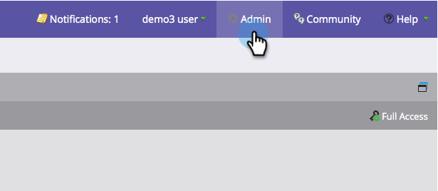
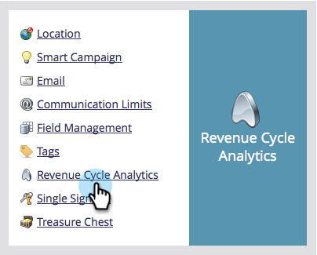

# Sincronizar Campos Personalizados com o [!UICONTROL Gerenciador de Receita] {#sync-custom-fields-to-the-revenue-explorer}

[!UICONTROL O Revenue Cycle Analytics] pode criar relatórios sobre campos personalizados do Marketo; para isso, é necessário definir os campos personalizados para serem sincronizados.

>[!NOTE]
>
>**Permissões de administrador são necessárias**

1. Vá para a seção **[!UICONTROL Admin]**.

   

1. Selecione **[!UICONTROL Análise do ciclo de receita]**.

   

1. Clique na guia **[!UICONTROL Sincronização de campo personalizado]** e escolha a área de análise de sua escolha.

   

1. Selecione o campo para o qual você deseja habilitar a sincronização e clique em **[!UICONTROL Editar Opção de Sincronização]**.

   

1. Altere o **[!UICONTROL Status de sincronização]** para **[!UICONTROL Habilitado]**.

   

1. Selecione o **[!UICONTROL Tipo de RCA]** de sua escolha e clique em **[!UICONTROL Salvar]**.

   

   >[!TIP]
   >
   >Depois de habilitado, os dados estarão disponíveis no [!UICONTROL Revenue Cycle Analytics] no dia seguinte.

   Excelente! Agora você sabe como adicionar campos personalizados ao RCA.
