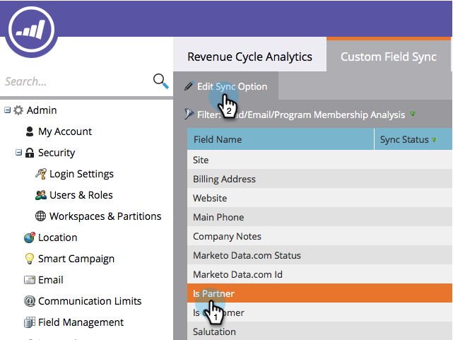

# Sincronizar campos personalizados com o Gerenciador de receita {#sync-custom-fields-to-the-revenue-explorer}

O Revenue Cycle Analytics pode criar relatórios sobre campos personalizados do Marketo; para isso, é necessário definir os campos personalizados para sincronização.

>[!NOTE]
>
>**Permissões de administrador necessárias**

1. Vá para a seção **Admin**.

   

1. Selecione **Análise do ciclo de receita**.

   

1. Clique na guia **Sincronização de campo personalizado** e escolha a área de análise de sua escolha.

   

1. Selecione o campo para o qual você deseja habilitar a sincronização e clique em **Editar Opção de Sincronização**.

   

1. Altere o **Status de sincronização** para **Habilitado**.

   

1. Selecione o **Tipo de RCA** de sua escolha e clique em **Salvar**.

   

   >[!TIP]
   >
   >Depois de habilitado, os dados estarão disponíveis no Revenue Cycle Analytics no dia seguinte.

   Excelente! Agora você sabe como adicionar campos personalizados ao RCA.
