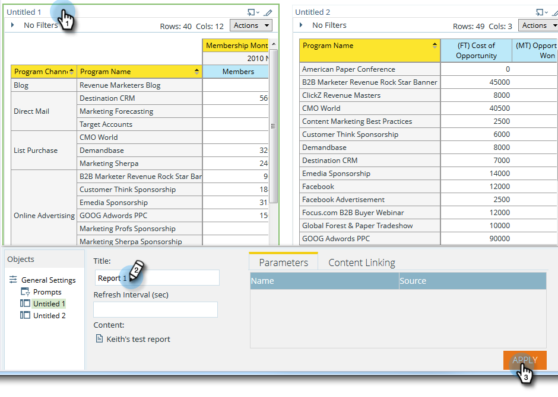

# Usando Painéis no [!UICONTROL Gerenciador de Receita] {#using-dashboards-in-revenue-explorer}

Um painel é uma combinação de relatórios do [!UICONTROL Explorador de Receita] para obter uma visão geral rápida de seus leads, campanhas, oportunidades e/ou modelos.

## Criar um novo painel {#creating-a-new-dashboard}

1. Clique em **[!UICONTROL Gerenciador de Receita]**.

   

1. Clique em **[!UICONTROL Criar Novo]** e depois em **[!UICONTROL Painel]**.

   

1. Na parte inferior da página, os Modelos serão selecionados por padrão. Clique no layout que deseja usar. &quot;2 colunas&quot; é usado aqui.

   

   >[!NOTE]
   >
   >Você pode personalizar ainda mais a aparência do seu painel clicando em **[!UICONTROL Temas]** e escolhendo seu favorito.

1. Na primeira seção do painel, clique no ícone **Inserir** e selecione **[!UICONTROL Arquivo]**.

   

1. Clique duas vezes em **[!UICONTROL Gerenciador de Receita]**.

   

1. Clique duas vezes em **[!UICONTROL Todos os Relatórios e Painéis]**.

   

1. Clique duas vezes na pasta que abriga o relatório que deseja usar.

   

1. Escolha seu relatório e clique em **[!UICONTROL Selecionar]**.

   

1. O relatório será preenchido. Repita as etapas 4 a 8 para cada seção restante.

   

1. Para renomear uma seção, clique nela para selecioná-la, digite o nome desejado em **[!UICONTROL Título]** e clique em **[!UICONTROL Aplicar]**. Repita o procedimento para cada seção.

   

1. Para salvar, clique no ícone [!UICONTROL Salvar], insira um [!UICONTROL Nome de arquivo], clique duas vezes na pasta [!UICONTROL Gerenciador de Receitas] até chegar à pasta desejada para o seu painel e clique em **[!UICONTROL Salvar]**.

   

## Editar um painel {#editing-a-dashboard}

1. Clique em **[!UICONTROL Gerenciador de Receita]**.

   

1. Clique duas vezes na pasta **[!UICONTROL Gerenciador de Receitas]**. Navegue até o local em que se encontra o painel.

   

1. Selecione o painel que deseja editar e clique em **[!UICONTROL Editar]**.

   

## Excluir um painel {#deleting-a-dashboard}

1. Clique em **[!UICONTROL Gerenciador de Receita]**.

   

1. Clique duas vezes na pasta **[!UICONTROL Gerenciador de Receitas]**. Navegue até o local em que se encontra o painel.

   

1. Selecione o painel que deseja excluir e clique em **[!UICONTROL Mover para o Lixeira]**.

   
