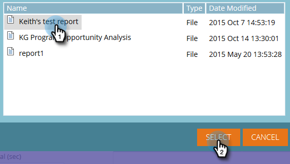
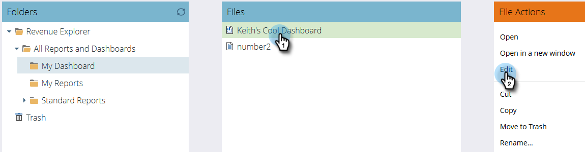

# Uso de painéis no Explorador de receita {#using-dashboards-in-revenue-explorer}

Um painel é uma combinação de relatórios do Revenue Explorer para obter uma visão geral rápida de seus leads, campanhas, oportunidades e/ou modelos.

## Criar um novo painel {#creating-a-new-dashboard}

1. Clique em **Explorador de receita**.

   

1. Clique em **Criar novo**, em seguida **Painel**.

   

1. Na parte inferior da página, Modelos serão selecionados por padrão. Clique no layout que deseja usar. &quot;2 Coluna&quot; é usada aqui.

   

   >[!NOTE]
   >
   >Você pode personalizar ainda mais a aparência do seu painel clicando em **Temas** e escolher o seu favorito.

1. Na primeira seção do painel, clique no botão **Inserir** e selecione **Arquivo**.

   

1. Clique duas vezes **Explorador de receita**.

   

1. Clique duas vezes **Todos os relatórios e painéis**.

   

1. Clique duas vezes na pasta que contém o relatório que deseja usar.

   

1. Escolha seu relatório e clique em **Selecionar**.

   

1. O relatório será então preenchido. Repita as etapas de 4 a 8 para cada seção restante.

   

1. Para renomear uma seção, clique nela para selecioná-la, digite o nome desejado em Título e clique em **Aplicar**. Repita para cada seção.

   

1. Para salvar, clique no ícone Salvar , insira um nome de arquivo, clique duas vezes na pasta Explorador de receita até chegar à pasta desejada para o painel e clique em **Salvar**.

   

## Editar um painel {#editing-a-dashboard}

1. Clique em **Explorador de receita**.

   

1. Clique duas vezes no botão **Explorador de receita** pasta. Navegue até o local onde seu painel está.

   

1. Selecione o painel que deseja editar e clique em **Editar**.

   

## Excluir um painel {#deleting-a-dashboard}

1. Clique em **Explorador de receita**.

   

1. Clique duas vezes no botão **Explorador de receita** pasta. Navegue até o local onde seu painel está.

   

1. Selecione o painel que deseja excluir e clique em **Mover para a lixeira**.

   
