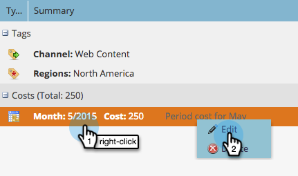

# Definir custos do período {#define-period-costs}

>[!NOTE]
>
>**Definição**
>
>Um custo do período é a quantia gasta em um programa. Pode ser por um ou mais meses e é usado para informar o ROI.

Rastreie e associe os custos de criação de clientes potenciais e de aquisição de clientes potenciais para um Programa ou Evento, definindo quando e onde você deseja obter os custos dos clientes potenciais.

>[!NOTE]
>
>No início de um Programa, informe os custos previstos. Quando o período no Programa for concluído, você poderá editar o [!UICONTROL Custo do Período] e inserir o custo real. Isso fornecerá resultados precisos de relatórios.

## Definir um [!UICONTROL Custo do Período] {#define-a-period-cost}

1. Acesse a guia **[!UICONTROL Configuração]** do seu Programa ou Evento.

   

1. Arraste e solte **[!UICONTROL Custo do Período]** na tela e a caixa de diálogo **[!UICONTROL Novo Custo]** será exibida.

   

1. Digite o **[!UICONTROL Mês do Programa]** que você deseja associar ao custo definido.

   

1. Insira um **[!UICONTROL Custo do Período]** como um número inteiro sem decimais ou vírgulas (limite máximo: 99999999)

   

   >[!NOTE]
   >
   >A moeda (por exemplo, USD, EUR etc.) é uma configuração global gerenciada por um administrador do Marketo

1. Insira uma **[!UICONTROL Nota]** descritiva (opcional) e clique em **[!UICONTROL Salvar]**.

   

## Editar um [!UICONTROL Custo do Período] {#edit-a-period-cost}

1. Clique com o botão direito do mouse em [!UICONTROL Custo do Período] e selecione **[!UICONTROL Editar]** no menu pop-up para abrir a caixa de diálogo **[!UICONTROL Editar Custo]**.

   

1. Edite o custo do período conforme necessário

   

## Excluir um [!UICONTROL Custo do Período] {#delete-a-period-cost}

1. Clique com o botão direito no [!UICONTROL Custo do Período] que deseja excluir e selecione **[!UICONTROL Excluir]** no menu pop-up para exibir o prompt **[!UICONTROL Excluir Custo]**.

   

1. Clique em **[!UICONTROL Excluir]** para excluir permanentemente o Custo do Período ou em **[!UICONTROL Cancelar]** para voltar.

   
