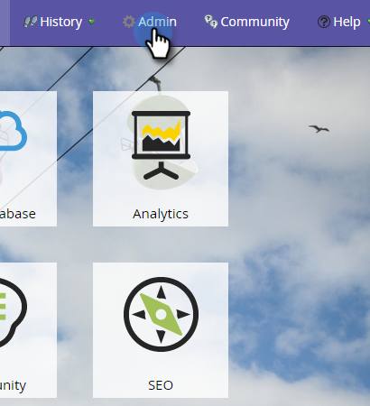
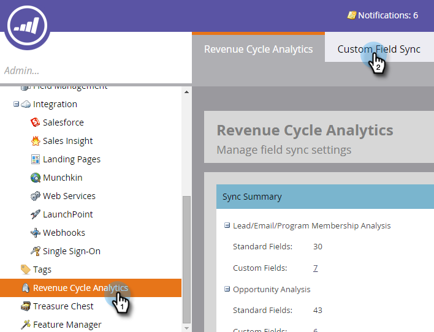

# Habilitando a Sincronização de Campo Personalizado para [!UICONTROL Análise do Ciclo de Receita] {#enabling-custom-field-sync-for-revenue-cycle-analytics}

As etapas a seguir permitirão utilizar campos personalizados em relatórios RCA.

1. Clique em **[!UICONTROL Administrador]**.

   

1. Clique em **[!UICONTROL Análise do Ciclo de Receita]**, depois em **[!UICONTROL Sincronização de Campo Personalizado]**.

   

1. Selecione seu **[!UICONTROL Nome do Campo]** e clique em **[!UICONTROL Editar Opção de Sincronização]**.

   

1. Em **[!UICONTROL Status de sincronização]**, selecione **[!UICONTROL Habilitado]** e clique em **[!UICONTROL Salvar]**.

   

1. A verificação verde permite saber que o campo está configurado para sincronização.

   

   E é isso!

   >[!NOTE]
   >
   >Depois que o campo for habilitado, os dados estarão disponíveis no [!UICONTROL Revenue Cycle Analytics] no dia seguinte.
