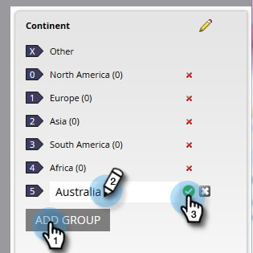

# Criar grupos de campos personalizados usando o Organizador de campos {#create-custom-field-groups-using-the-field-organizer}

Antes de habilitar grupos de campos personalizados para relatórios na Área de Análise de Desempenho do Modelo (Leads) do Ciclo de Receita do Explorer, você deve categorizar os campos padrão ou personalizados em grupos para relatórios através do Organizador de Campos no Gerenciamento de Clientes Potenciais. Isso se aplica somente aos atributos lead e empresa.
Quando um campo padrão ou personalizado é selecionado na lista suspensa Campo na caixa de diálogo Novo organizador de campos, o sistema mapeia o tipo de dados do Gerenciamento de vendas associado ao campo que você deseja agrupar com um dos três editores disponíveis no Organizador de campos: string, número inteiro ou data.

| Tipo de dados de gerenciamento líder de mercado | Tipo de Dados do Editor do Organizador de Campos |
|---|---|
| String | String |
| Email | String |
| Número inteiro | Número inteiro |
| Texto | String |
| URL | String |
| Referência | Não suportado |
| Moeda | Número inteiro |
| DateTime | Data |
| Booleano | Não suportado |
| Telefone | String |
| Data | Data |
| Flutuar | Número inteiro |
| Calculado | Não suportado |

As próximas três seções descrevem como criar um grupo de campos personalizado para uma string, número inteiro ou tipo de data.

## Criar grupo de campos personalizado - Editor de sequências de caracteres {#create-custom-field-group-string-editor}

1. Clique em Banco de Dados **Principal**.

   

1. Clique em **Novo** e selecione **Novo organizador** de campos.

   

1. Clique em **Campo** e selecione um campo padrão ou personalizado com um tipo de dados que mapeie para o editor de sequências de caracteres (consulte a tabela na seção anterior). País é usado aqui.

   

1. Clique em **Criar**.

   

   O novo grupo personalizado é exibido na árvore Banco de Dados Principal representada como Nome do Campo > Grupo de Nome do Campo (por exemplo: País > Grupo de países).

   

1. Clique no ícone de lápis para personalizar o nome. Por exemplo, você pode renomear &quot;Grupo de países&quot; como &quot;Continente&quot;. Digite o novo nome desejado e clique fora da caixa para salvar automaticamente.

   

1. Por padrão, todos os valores de dados são colocados no subgrupo &quot;Outros&quot;. Para categorizar os valores de dados, clique em **Adicionar grupo** para criar um subgrupo e dar um nome a ele.

   >[!NOTE]
   >
   >É possível adicionar até dez subgrupos para categorizar os valores de dados. A cada subgrupo criado é atribuído um número de ID.

   Neste exemplo, grupos foram criados para a maioria dos continentes.

   

   >[!NOTE]
   >
   >Para excluir um subgrupo, basta clicar no X vermelho ao lado do nome do subgrupo. Se houver algum valor de dados no grupo, os valores de dados serão movidos para o grupo padrão Outros.

1. Realce um ou mais valores de dados na tela e arraste e solte os valores de dados no subgrupo apropriado.

   

   >[!NOTE]
   >
   >Para remover um valor de dados de um subgrupo, atribua o valor de dados ao grupo padrão Outros.

1. Use a opção de filtro no canto superior esquerdo, logo acima da tela, para selecionar e visualização os valores de dados em um ou mais subgrupos. Os valores de dados com base na sua seleção de filtro são exibidos na tela.

   

   >[!NOTE]
   >
   >Após a definição dos grupos, é possível ativar o grupo de campos personalizado para relatórios na Análise de desempenho do modelo (Clientes potenciais) por meio da guia Análises do ciclo de receita no Gerenciamento de clientes potenciais de marketing.

## Criar grupo de campos personalizado - Editor de números inteiros {#create-custom-field-group-integer-editor}

1. Clique em Banco de Dados **Principal**.

   

1. Clique em **Novo** e selecione **Novo organizador** de campos.

   

1. Clique em **Campo** e selecione um campo padrão ou personalizado com um tipo de dados que mapeie para o editor de sequências de caracteres (consulte a tabela na seção anterior). Receita anual é usada aqui.

   

1. Clique em **Criar**.

   

   O novo grupo personalizado é exibido na árvore Banco de Dados Principal representada como Nome do Campo > Grupo de Nome do Campo (por exemplo: Receita anual > Grupo de Receita anual).

   

1. Clique no nome do grupo personalizado padrão acima do editor de números inteiros para personalizar o nome. Por exemplo, você pode renomear &quot;Grupo de Receita Anual&quot; para &quot;Receita Anual por Tamanho&quot;. Clique em **Salvar**.

   

   O editor de números inteiros permite que você crie vários subgrupos para definir cada subgrupo por tamanho. Neste exemplo, três grupos serão criados para pequenas, médias e empresas.

1. Para adicionar seu primeiro grupo, digite um nome no campo Nome **do** grupo (por exemplo: Pequeno) e insira um valor máximo no campo Intervalo de **grupo** (por exemplo: 200000). Clique em **Adicionar grupo**.

   

   Uma entrada de grupo vazia é exibida abaixo do grupo recém-inserido. O exemplo abaixo mostra uma entrada para Pequenas, Médias e Empresas.

   >[!NOTE]
   >
   >É possível adicionar até dez subgrupos para categorizar os valores de dados. Cada entrada de Intervalo de grupo é desenvolvida com base na entrada anterior. Se você deixar a última entrada Intervalo de grupo em branco para o último subgrupo personalizado criado, um valor máximo de dados não será definido.

1. Clique na guia Resumo para salvar e revisar suas configurações.

   

   >[!NOTE]
   >
   >Para excluir um subgrupo, clique no X vermelho ao lado do nome do subgrupo.

1. Na página Resumo, reveja suas configurações.

   

   >[!NOTE]
   >
   >Após a definição dos grupos, é possível ativar o grupo de campos personalizado para relatórios na Análise de desempenho do modelo (Clientes potenciais) por meio da guia Análises do ciclo de receita no Gerenciamento de clientes potenciais de marketing.

## Criar grupo de campos personalizado - Editor de datas {#create-custom-field-group-date-editor}

1. Clique em Banco de Dados **Principal**.

   

1. Clique em **Novo** e selecione **Novo organizador** de campos.

   

1. Clique em **Campo** e selecione um campo padrão ou personalizado com um tipo de dados que mapeie para o editor de sequências de caracteres (consulte a tabela na seção anterior). A Data de aquisição é usada aqui.

   

1. Clique em **Criar**.

   

   O novo grupo personalizado é exibido na árvore Banco de Dados Principal representada como Nome do Campo > Grupo de Nome do Campo (por exemplo: Data de aquisição > Grupo de datas de aquisição).

   

1. Clique no nome do grupo personalizado padrão acima do editor de datas para personalizar o nome. Por exemplo, você pode renomear &quot;Grupo de datas de aquisição&quot; como &quot;Categorias de data de aquisição&quot;. Clique em **Salvar**.

   

   O editor de datas permite que você crie vários subgrupos e defina cada subgrupo por data. Neste exemplo, três grupos serão criados: T1-15 Clientes potenciais, T2-15 clientes potenciais e T3-15 clientes potenciais.

1. Para adicionar seu primeiro grupo, digite um nome no campo Nome **do** grupo (por exemplo: T1-15 Clientes potenciais) e insira uma data no campo de data que representa a data em que o cliente potencial foi adquirido em ou antes (por exemplo: 31/03/2015 para o último dia do T1-15). Clique em **Adicionar grupo**.

   

   >[!NOTE]
   >
   >É possível adicionar até dez subgrupos para categorizar os valores de dados. Cada entrada de Intervalo de grupo é desenvolvida com base na entrada anterior. Se você deixar a última entrada Intervalo de grupo em branco para o último subgrupo personalizado criado, um valor de data final não será definido.

   

   E é isso! Bom trabalho.

O exemplo abaixo mostra uma entrada para o primeiro trimestre de 2015 nos clientes potenciais até o terceiro trimestre.