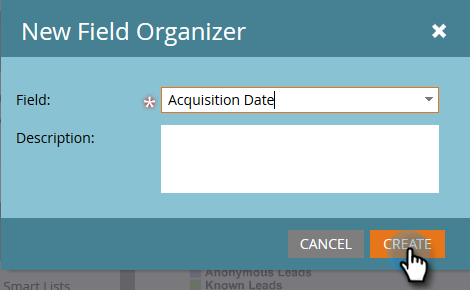
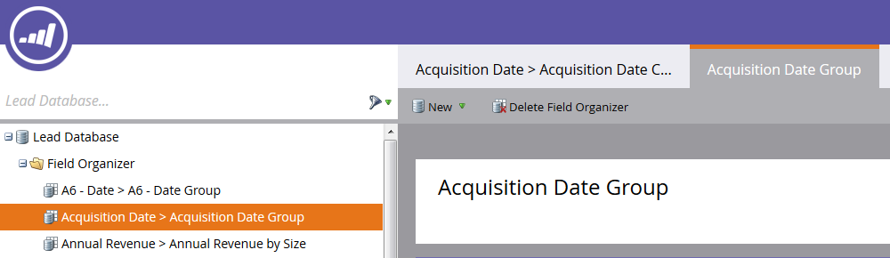
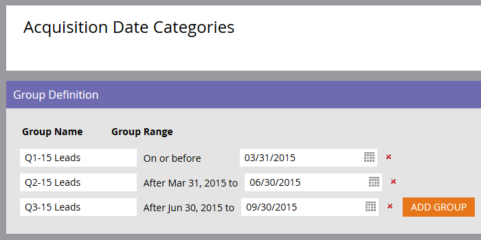

# Criar grupos de campos personalizados usando o Organizador de campos {#create-custom-field-groups-using-the-field-organizer}

Antes de habilitar grupos de campos personalizados para relatórios na Área de Análise de Desempenho do Modelo (Leads) do Ciclo de Receita do Explorer, você deve categorizar campos padrão ou personalizados em grupos para relatório através do Organizador de Campos no Marketo Lead Management. Isso se aplica somente aos atributos de cliente potencial e empresa.
Quando você seleciona um campo padrão ou personalizado na lista suspensa Campo na caixa de diálogo Novo Organizador de Campos, o sistema mapeia o tipo de dados do Marketo Lead Management associado ao campo que você deseja agrupar com um dos três editores disponíveis no Organizador de Campos: string, número inteiro ou data.

| Tipo de dados do Gerenciamento de clientes potenciais da Marketo | Tipo de Dados do Editor do Organizador de Campos |
|---|---|
| Sequência de caracteres | Sequência de caracteres |
| E-mail | Sequência de caracteres |
| Inteiro | Inteiro |
| Texto | Sequência de caracteres |
| URL | Sequência de caracteres |
| Referência | Não suportado |
| Moeda | Inteiro |
| DateTime | Data |
| Booleano | Não suportado |
| Telefone | Sequência de caracteres |
| Data | Data |
| Flutuante | Inteiro |
| Calculado | Não suportado |

As próximas três seções descrevem como criar um grupo de campos personalizado para um tipo de string, inteiro ou data.

## Criar grupo de campos personalizado - Editor de cadeia de caracteres {#create-custom-field-group-string-editor}

1. Clique em **Banco de dados de clientes potenciais**.

   

1. Clique em **Novo** e selecione **Novo Organizador de Campos**.

   

1. Clique em **Campo** e selecione um campo padrão ou personalizado com um tipo de dados que mapeie para o editor de sequência de caracteres (consulte a tabela na seção anterior). País é usado aqui.

   

1. Clique em **Criar**.

   

   O novo grupo personalizado é exibido na árvore do Banco de Dados de Lead representada como Nome do Campo > Grupo de Nome do Campo (exemplo: País > Grupo de países).

   

1. Clique no ícone de lápis para personalizar o nome. Por exemplo, você pode renomear &quot;Grupo de países&quot; para &quot;Continente&quot;. Digite o novo nome desejado e clique em sair da caixa para salvar automaticamente.

   

1. Por padrão, todos os valores de dados são colocados no subgrupo &quot;Outros&quot;. Para categorizar os valores de dados, clique em **Adicionar grupo** para criar um subgrupo e fornecer um nome a ele.

   >[!NOTE]
   >
   >Você pode adicionar até dez subgrupos para categorizar os valores de dados. A cada subgrupo criado é atribuído um número de ID.

   Neste exemplo, grupos foram criados para a maioria dos continentes.

   

   >[!NOTE]
   >
   >Para excluir um subgrupo, basta clicar no X vermelho ao lado do nome do subgrupo. Se houver algum valor de dados no grupo, os valores de dados serão movidos para o grupo padrão Outros.

1. Realce um ou mais valores de dados na tela e arraste e solte os valores de dados no subgrupo apropriado.

   

   >[!NOTE]
   >
   >Para remover um valor de dados de um subgrupo, atribua o valor de dados ao grupo padrão Outros.

1. Use a opção de filtro no canto superior esquerdo diretamente acima da tela para selecionar e exibir os valores de dados em um ou mais subgrupos. Os valores de dados com base na seleção de filtro são exibidos na tela.

   

   >[!NOTE]
   >
   >Após a definição dos grupos, é possível ativar o grupo de campos personalizado para relatórios na Análise de desempenho do modelo (Leads) por meio da guia Análise de ciclo de receita no Gerenciamento de clientes potenciais da Marketo.

## Criar grupo de campos personalizado - Editor de números inteiros {#create-custom-field-group-integer-editor}

1. Clique em **Banco de dados de clientes potenciais**.

   

1. Clique em **Novo** e selecione **Novo Organizador de Campos**.

   

1. Clique em **Campo** e selecione um campo padrão ou personalizado com um tipo de dados que mapeie para o editor de sequência de caracteres (consulte a tabela na seção anterior). Receita anual é usada aqui.

   

1. Clique em **Criar**.

   

   O novo grupo personalizado é exibido na árvore do Banco de Dados de Lead representada como Nome do Campo > Grupo de Nome do Campo (exemplo: Receita Anual > Grupo Receita Anual).

   

1. Clique no nome do grupo personalizado padrão acima do editor de números inteiros para personalizar o nome. Por exemplo, você pode renomear &quot;Grupo de Receita Anual&quot; para &quot;Receita Anual por Tamanho&quot;. Clique em **Salvar**.

   

   O editor de números inteiros permite criar vários subgrupos para definir cada subgrupo por tamanho. Neste exemplo, três grupos serão criados para pequenas, médias e empresas.

1. Para adicionar seu primeiro grupo, insira um nome no **Nome do grupo** (exemplo: Pequeno) e insira um valor máximo no **Intervalo de grupo** (exemplo: 200000). Clique em **Adicionar grupo**.

   

   Uma entrada de grupo vazia é exibida abaixo do grupo recém-inserido. O exemplo abaixo mostra uma entrada para pequenas, médias e empresas.

   >[!NOTE]
   >
   >Você pode adicionar até dez subgrupos para categorizar os valores de dados. Cada entrada de Intervalo de grupo é baseada na entrada anterior. Se você deixar a última entrada Intervalo de grupo em branco para o último subgrupo personalizado criado, um valor de dados máximo não será definido.

1. Clique na guia Resumo para salvar e revisar suas configurações.

   

   >[!NOTE]
   >
   >Para excluir um subgrupo, clique no X vermelho ao lado do nome do subgrupo.

1. Na página Resumo , revise as configurações.

   

   >[!NOTE]
   >
   >Após a definição dos grupos, é possível ativar o grupo de campos personalizado para relatórios na Análise de desempenho do modelo (Leads) por meio da guia Análise de ciclo de receita no Gerenciamento de clientes potenciais da Marketo.

## Criar grupo de campos personalizado - Editor de datas {#create-custom-field-group-date-editor}

1. Clique em **Banco de dados de clientes potenciais**.

   

1. Clique em **Novo** e selecione **Novo Organizador de Campos**.

   

1. Clique em **Campo** e selecione um campo padrão ou personalizado com um tipo de dados que mapeie para o editor de sequência de caracteres (consulte a tabela na seção anterior). A Data de aquisição é usada aqui.

   

1. Clique em **Criar**.

   

   O novo grupo personalizado é exibido na árvore do Banco de Dados de Lead representada como Nome do Campo > Grupo de Nome do Campo (exemplo: Data de aquisição > Grupo de data de aquisição).

   

1. Clique no nome do grupo personalizado padrão acima do editor de datas para personalizar o nome. Por exemplo, você pode renomear &quot;Grupo de datas de aquisição&quot; para &quot;Categorias de datas de aquisição&quot;. Clique em **Salvar**.

   

   O editor de datas permite criar vários subgrupos e definir cada subgrupo por data. Neste exemplo, três grupos serão criados: T1-15 Leads, T2-15 Leads e T3-15 Leads.

1. Para adicionar seu primeiro grupo, insira um nome no **Nome do grupo** (exemplo: P1-15 Leads) e insira uma data no campo de data que represente a data em que o lead foi adquirido em ou antes (por exemplo: 31/3/2015 para o último dia do primeiro trimestre (T1-15). Clique em **Adicionar grupo**.

   

   >[!NOTE]
   >
   >Você pode adicionar até dez subgrupos para categorizar os valores de dados. Cada entrada de Intervalo de grupo é baseada na entrada anterior. Se você deixar a última entrada Intervalo de grupo em branco para o último subgrupo personalizado criado, um valor de data final não será definido.

   O exemplo abaixo mostra uma entrada para os leads do primeiro trimestre de 2015 até o terceiro trimestre.

   

   E é isso! Bom trabalho.
