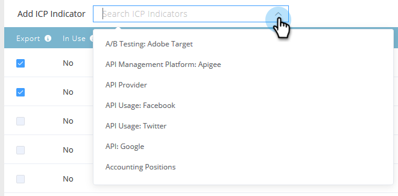

# Classificação e ajuste do perfil da conta {#account-profiling-ranking-and-tuning}

A criação de perfil de conta identifica o ICP (Perfil do cliente ideal), classifica empresas no banco de dados com base no ICP e adiciona dados do indicador ICP a contas promovidas como contas nomeadas.

## Resultados do Modelo {#model-results}

Os resultados mostram todas as suas contas conhecidas detalhadas por grau. A é o grau mais alto, D é o mais baixo.

Embora seja opcional, recomendamos marcar a caixa de seleção Promover automaticamente , pois isso economizará muito tempo. No entanto, se você quiser passar por cada conta e [adicioná-las manualmente](/help/marketo/product-docs/target-account-management/target/named-accounts/discover-accounts.md#discover-crm-accounts), deixe a caixa desmarcada.

<table> 
 <tbody> 
  <tr> 
   <td><strong>Classificação</strong></td> 
   <td> 
    

      Classificação da conta com base no Perfil ideal do cliente. A é o melhor ajuste, D é o menos adequado. 
    
</td> 
  </tr> 
  <tr> 
   <td><strong>Propensão</strong></td> 
   <td> 
    

      Aumento estimado na taxa de conversão em comparação com uma seleção de contas não baseada em ICP. 
    
</td> 
  </tr> 
  <tr> 
   <td><strong>Contas (%)</strong></td> 
   <td> 
    

      Porcentagem de contas na entrada do modelo que têm essa classificação. 
    
</td> 
  </tr> 
  <tr> 
   <td><strong>% de Base de Modelo</strong></td> 
   <td> 
    

      Porcentagem de contas com base em modelo que têm essa classificação. 
    
</td> 
  </tr> 
 </tbody> 
</table>

## Ajuste do modelo {#model-tuning}

Na guia Modelo, clique no botão Ajustar modelo.

Há várias guias para escolher, permitindo uma personalização detalhada.

**Categorias de indicadores**

<table> 
 <tbody> 
  <tr> 
   <td><strong>Conformidade</strong></td> 
   <td> 
    

      Certificações, posições relacionadas com a conformidade/contratação. 
    
</td> 
  </tr> 
  <tr> 
   <td><strong>Operações</strong></td> 
   <td> 
    

      Posições/contratação relacionadas com operações. 
    
</td> 
  </tr> 
  <tr> 
   <td><strong>HR</strong></td> 
   <td> 
    

      Software de RH ou Folha de Pagamento, posições relacionadas com RH/contratação.
    
</td> 
  </tr> 
  <tr> 
   <td><strong>Engenharia</strong></td> 
   <td> 
    

      Tecnologias, quadros, posições relacionadas com a engenharia/contratação. 
    
</td> 
  </tr> 
  <tr> 
   <td><strong>Vendas</strong></td> 
   <td> 
    

      Soluções e software para vendas, posições relacionadas às vendas/contratação. 
    
</td> 
  </tr> 
  <tr> 
   <td><strong>Intenção</strong></td> 
   <td> 
    

      Indicadores de intenção. 
    
</td> 
  </tr> 
  <tr> 
   <td><strong>IT</strong></td> 
   <td> 
    

      Soluções de hardware e software, tecnologias, posições relacionadas à TI/contratação.
    
</td> 
  </tr> 
  <tr> 
   <td><strong>Finanças</strong></td> 
   <td> 
    

      Software financeiro, posições financeiras/contratação. 
    
</td> 
  </tr> 
  <tr> 
   <td><strong>Marketing</strong></td> 
   <td> 
    

      Tecnologias e software de marketing, posições relacionadas ao marketing/contratação. 
    
</td> 
  </tr> 
  <tr> 
   <td><strong>Negócios</strong></td> 
   <td> 
    

      Listas da Forbes ou Inc. ou parcerias de negócios. 
    
</td> 
  </tr> 
  <tr> 
   <td><strong>Experiência e relações com o cliente</strong></td> 
   <td> 
    

      Posições/contratações de sucesso e relações com o cliente.
    
</td> 
  </tr> 
 </tbody> 
</table>

Passe o mouse sobre as dicas de ferramenta para obter uma descrição de cada coluna.

Clique na lista suspensa Adicionar indicador ICP para inserir indicadores adicionais no modelo.

Marcar a caixa Exportar permite ver o indicador ICP na página Detalhes da conta nomeada, bem como usar o indicador ICP selecionado como restrições em [Filtros de conta nomeados](/help/marketo/product-docs/target-account-management/engage/account-filters.md).

>[!NOTE]
>
>Os indicadores ICP são incluídos como restrições em **Membro de Conta Nomeada** Filtros e Acionadores.

Peso do indicador é o que controla o nível de importância que cada indicador recebe no modelo.

Clique em Atualizar modelo para que essas alterações entrem em vigor.

Quando terminar de ajustar o modelo (depois de atualizá-lo), volte para a guia Resultados do Modelo e clique em **Salvar e aplicar classificações**.

