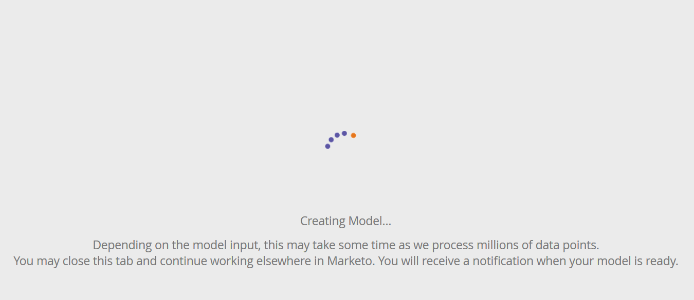

# Configuração da criação de perfis de conta {#setting-up-account-profiling}

Siga estas etapas para começar a usar a Criação de perfil da conta.

>[!IMPORTANT]
>
>A partir de 2025, a Criação de perfil da conta não estará mais disponível para novos usuários. Ele continuará a funcionar para os usuários existentes.

>[!CAUTION]
>
>Os campos a seguir **não** devem estar ocultos para que o Perfil de Conta funcione corretamente.
>
>* Site
>* Empresa
>* Email
>* País
>
>Saiba como [reexibir um campo aqui](/help/marketo/product-docs/administration/field-management/hide-and-unhide-a-field.md#unhide-a-field).

1. Em Minha Marketo, abra **[!UICONTROL Gerenciamento de Conta do Target]**.

   

1. Clique na guia **[!UICONTROL Perfil da conta]**.

   

1. A guia Modelo é aberta por padrão. Clique em **[!UICONTROL Começar]**.

   

1. Dê um nome ao seu modelo e escolha o tipo de lista/lista de pessoas que servirão como base para o Perfil de cliente ideal (ICP). Clique em **[!UICONTROL Criar Modelo]** quando terminar.

   

1. Seu modelo iniciará a criação. Isso pode demorar um pouco, mas não se preocupe, você será notificado quando isso for concluído.

   

1. Para ver os resultados do seu modelo, clique em **[!UICONTROL Ver Resultado do Modelo]**.

   

   Seu modelo foi criado.

   

   >[!TIP]
   >
   >Agora que seu modelo foi criado, [saiba como ajustá-lo](/help/marketo/product-docs/target-account-management/account-profiling/account-profiling-ranking-and-tuning.md).
