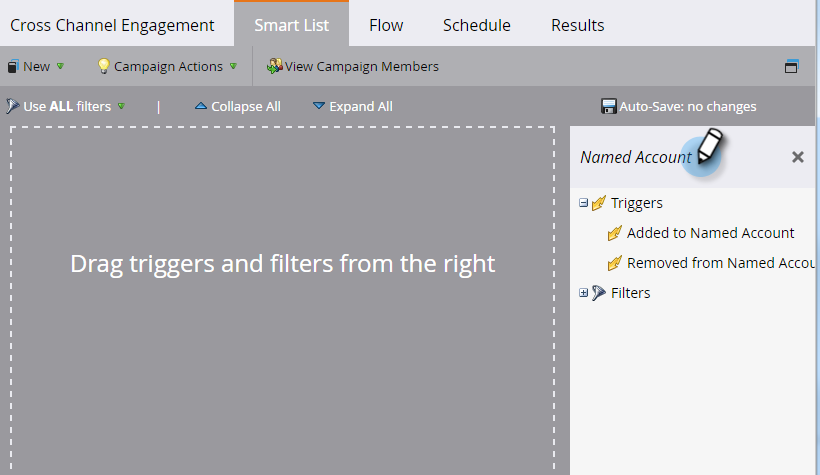

# Acionadores de conta {#account-triggers}

Ouça e aja em atividades comportamentais importantes no nível da conta em diferentes canais (por exemplo, email, Web, anúncios) usando acionadores no nível da conta.

Selecione sua campanha inteligente e clique em **[!UICONTROL Smart List]**.

Insira &quot;[!UICONTROL Conta Nomeada]&quot; na caixa de pesquisa para localizar os acionadores [!UICONTROL Conta Nomeada].

Arraste o acionador desejado para a tela. Neste exemplo, estamos usando _[!UICONTROL Adicionado à Conta Nomeada]_.

Escolha um qualificador.

Clique na lista suspensa de contas nomeadas...

...e escolha sua(s) conta(s) nomeada(s) desejada(s).

Pronto! Depois de concluir o restante da campanha inteligente, lembre-se de ativá-la.

>[!MORELIKETHIS]
>
>[Filtros de Conta](/help/marketo/product-docs/target-account-management/engage/account-filters.md)
