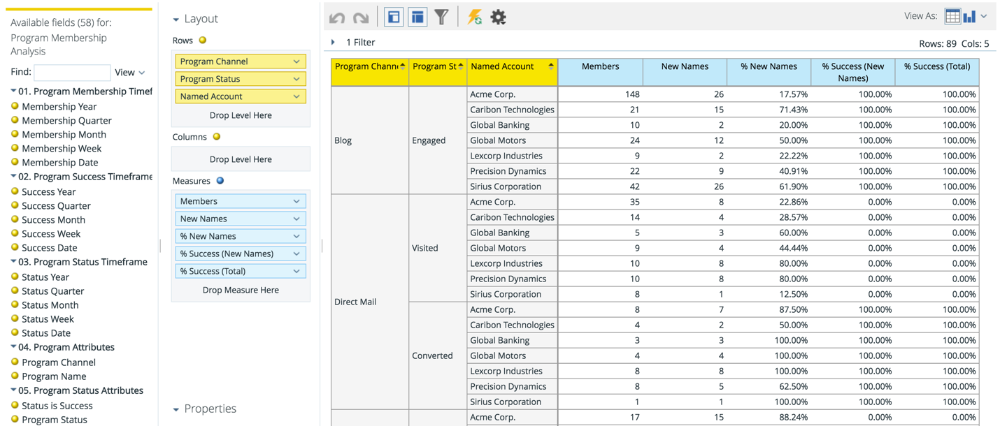
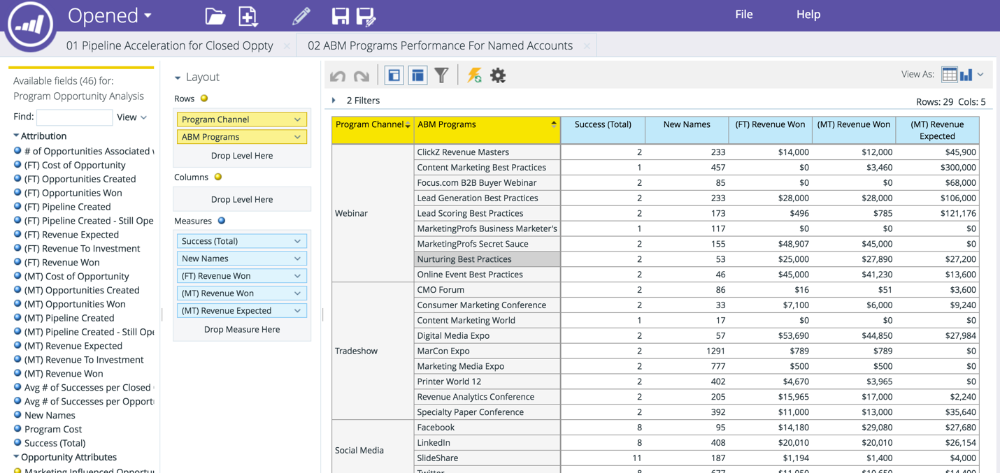

# Dimensão de conta nomeada na RCA {#named-account-dimension-in-rca}

Crie relatórios baseados em receita usando a dimensão Conta nomeada específica do TAM no Revenue Cycle Analytics.

>[!NOTE]
>
>**Dimensões** - atributos (representados por pontos amarelos) que fornecem exibições diferentes das medidas.

>[!NOTE]
>
>A dimensão Conta nomeada na RCA pode ser usada para medir o impacto final das contas direcionadas (por exemplo, receita ganha, pipeline gerado ou aceleração no ciclo de vendas). Essa dimensão também pode ser usada para identificar quais programas tiveram ou não um bom desempenho em relação às contas nomeadas.

Os relatórios a seguir têm acesso à dimensão Conta Nomeada:

* Análise de emails
* Análise de leads
* Análise de oportunidades
* Análise de participação no programa

>[!NOTE]
>
>Abaixo estão alguns exemplos de Marketo TAM no Revenue Cycle Analytics.

Aceleração de pipeline em contas nomeadas

Eficácia e sucesso do canal por contas nomeadas

Eficácia e impacto do programa nos resultados financeiros

Cobertura de clientes potenciais de qualidade e envolvimento em contas nomeadas

