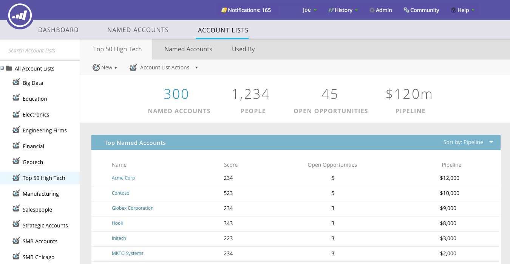

# Painel principal do TAM {#tam-main-dashboard}

O painel principal fornece um resumo dos seus esforços do [!UICONTROL Gerenciamento de Conta do Target]. Você pode ver as contas de destino ou as listas de contas que estão mostrando sucesso e aquelas que precisam de mais atenção.

Para filtrar por lista de contas, clique no menu suspenso **[!UICONTROL Exibir]**...

...e faça uma seleção. Neste exemplo, estamos escolhendo nossa lista de contas de &quot;**[!UICONTROL Alta Tecnologia]**&quot;.

Para exibir o [Painel de Lista de Contas](/help/marketo/product-docs/target-account-management/measure/account-list-insights.md#account-list-dashboard), clique no nome da lista de contas selecionada...

...e o painel é carregado.

Se, em vez de visualizar o Painel da Lista de Contas que você deseja detalhar em uma conta nomeada, clique em **[!UICONTROL Mais Detalhes]** sob seu nome...

...e exiba os [insights da conta nomeada](/help/marketo/product-docs/target-account-management/measure/named-account-insights.md).

