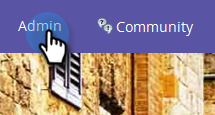
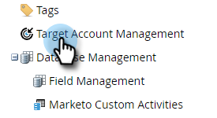
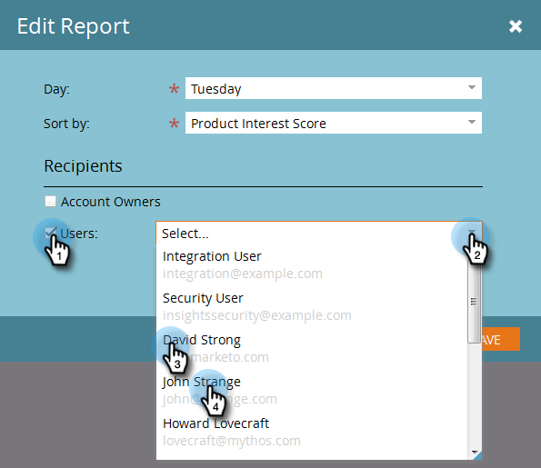
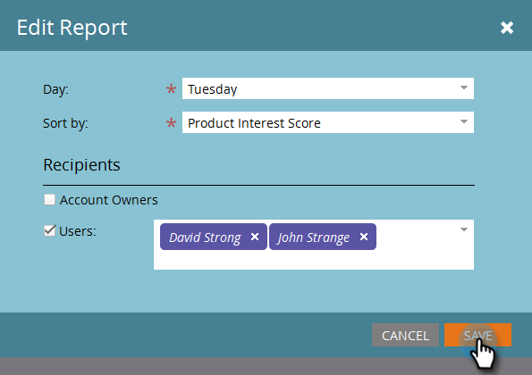
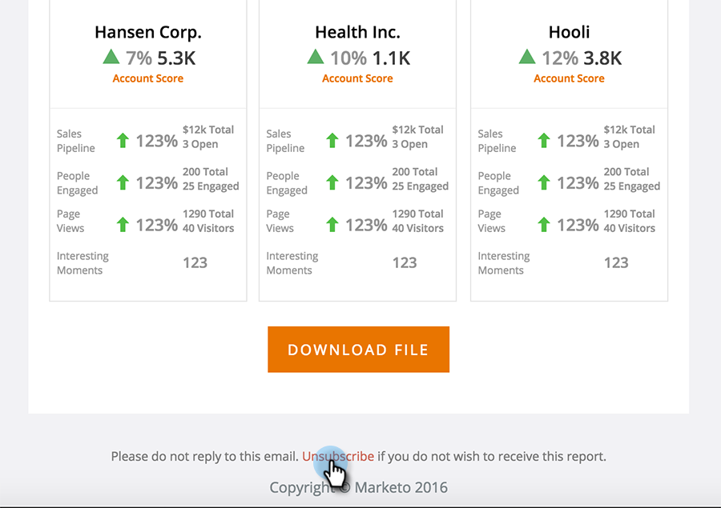

# Configuração de relatório do TAM {#tam-report-setup}

O Relatório de vendas do TAM é um e-mail personalizado semanal enviado à equipe de conta.

## Configuração do relatório {#report-setup}

1. Clique em **[!UICONTROL Administrador]**.

   

1. Clique em **[!UICONTROL Gerenciamento de Conta de Destino]**.

   

1. Em [!UICONTROL Relatório semanal], clique em **[!UICONTROL Editar]**.

   

1. Clique no menu suspenso **[!UICONTROL Day]** e selecione o dia da semana em que deseja que os recipients recebam o email.

   

1. Para determinar o layout do seu email, clique no menu suspenso **[!UICONTROL Classificar por]** e faça uma seleção.

   

1. Marque a caixa de seleção **[!UICONTROL Usuários]**, clique na lista suspensa e selecione quem deseja receber o email.

   

   >[!NOTE]
   >
   >As notificações serão enviadas somente aos proprietários da conta ou aos membros da equipe.

1. Clique em **[!UICONTROL Salvar]**.

   

E é isso!

## Como cancelar a inscrição {#how-to-unsubscribe}

Cada relatório vem com a opção de não participação. Para fazer isso, basta clicar em **[!UICONTROL Cancelar inscrição]** na parte inferior do email.

## Como refazer a assinatura {#how-to-resubscribe}

1. Clique em **[!UICONTROL Administrador]**.

   

1. Clique em **[!UICONTROL Gerenciamento de Conta de Destino]**.

   

1. Em [!UICONTROL Relatório semanal], clique no número listado como [!UICONTROL Cancelar inscrição].

   

1. Clique no menu suspenso **[!UICONTROL Usuários]**.

   

1. Selecione o usuário que deseja receber emails novamente e clique em **[!UICONTROL Assinar Novamente]**.

   
