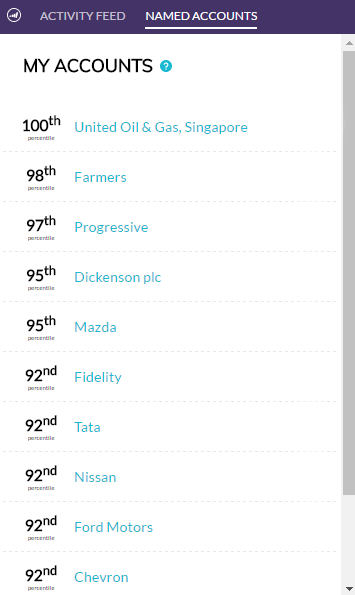
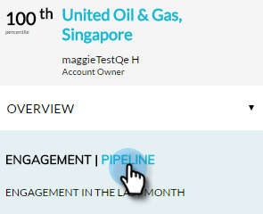

# Visão geral do plug-in Account Insight {#account-insight-plug-in-overview}

O Account Insight é um plug-in do Chrome que exibe as informações acionáveis da TAM e da conta das equipes de vendas, permitindo que elas envolvam contas de forma mais eficaz.

>[!AVAILABILITY]
>
>O Account Insight é incluído para todos os clientes que têm o TAM e o Marketo Sales Insight. Para clientes que têm apenas o TAM, o Account Insight está disponível como um complemento adquirido. Cada cliente está limitado a 250 lugares do Account Insight. Entre em contato com seu representante de vendas para obter detalhes. Não está disponível para clientes que não têm TAM.

>[!CAUTION]
>
>O plug-in Account Insight não funcionará em assinaturas que têm [Somente SSO](/help/marketo/product-docs/administration/additional-integrations/restrict-user-login-to-sso-only.md) (logon único) ativado.

>[!CAUTION]
>
>O contexto do CRM funciona para o Salesforce ao iniciar o plug-in de uma Conta, Cliente Potencial ou Contato. O contexto do CRM não funcionará para o Dynamics ao iniciar o plug-in de uma Conta, Cliente Potencial ou Contato. Para usuários do Dynamics, recomendamos usar o plug-in Account Insight .

## Contas nomeadas {#named-accounts}

Veja as contas nomeadas em ordem de classificação entre si. Essa lista está disponível somente para proprietários de contas. O suporte da equipe de conta será lançado em breve.

Para ver detalhes de uma conta nomeada, clique no nome...

...e a visão geral será exibida.

Veja momentos interessantes usando o menu suspenso .

Role para baixo para ver as melhores apostas. Momentos interessantes também são aqui, junto com pessoas engajadas.

Clique no nome de uma pessoa...

...e veja a atividade.

Também é possível alternar a exibição de Envolvimento para Pipeline.

Para sair da conta nomeada, clique no X no canto superior direito.

## Feed de atividade {#activity-feed}

O feed de atividade mostra a atividade recente, retornando sete dias.

Clique no botão **Filtro** para filtrar por tipos de atividades diferentes.

Vários itens podem ser clicados. Clique na conta nomeada para ver seus detalhes. Clique no nome do usuário para ver sua atividade. Clique em Mais atividades para ver, bem, mais atividades.

Coisa muito legal!

>[!MORELIKETHIS]
>
>[Configurar Insight da conta](/help/marketo/product-docs/target-account-management/setup-tam/set-up-account-insight.md)
