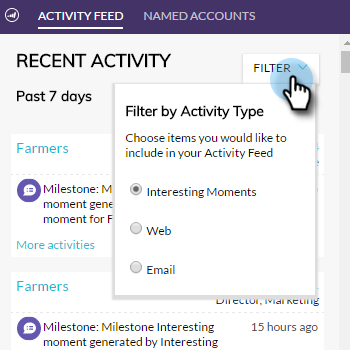

# Visão geral do plug-in Insight da conta {#account-insight-plug-in-overview}

O Account Insight é um plug-in do Chrome que revela TAM acionável e insights de conta para suas equipes de vendas, permitindo que elas envolvam contas com mais eficiência.

>[!AVAILABILITY]
>
>* O Account Insight está incluído para todos os clientes que têm o TAM e o Marketo Sales Insight. Para clientes que possuem apenas o TAM, o Account Insight está disponível como um complemento adquirido. Cada cliente está limitado a 250 estações do Account Insight. Entre em contato com seu representante de vendas para obter mais detalhes. Ele não está disponível para clientes que não têm TAM.
>
>* Este plug-in não é compatível com a [autenticação de identidade de Adobe](/help/marketo/product-docs/administration/marketo-with-adobe-identity/adobe-identity-management-overview.md){target="_blank"} no momento.

>[!CAUTION]
>
>O plug-in Insight de conta não funcionará em assinaturas com [somente SSO](/help/marketo/product-docs/administration/additional-integrations/restrict-user-login-to-sso-only.md) (logon único) habilitado.

>[!CAUTION]
>
>O contexto do CRM funciona para o Salesforce ao iniciar o plug-in a partir de uma Conta, Cliente Potencial ou Contato. O contexto do CRM não funcionará para o Dynamics ao iniciar o plug-in a partir de uma Conta, Cliente Potencial ou Contato. Para usuários do Dynamics, recomendamos usar o plug-in Insight de conta.

## Contas nomeadas {#named-accounts}

Consulte contas nomeadas na ordem de classificação entre si. Essa lista está disponível somente para proprietários de conta. O suporte à equipe de conta será disponibilizado em breve.

Para ver detalhes de uma conta nomeada, clique no nome dela...

...e a visão geral é exibida.

Veja momentos interessantes usando o menu suspenso.

Role para baixo para ver as melhores opções. Momentos interessantes também estão aqui, junto com pessoas engajadas.

Clique no nome de uma pessoa...

...e veja a atividade deles.

Você também pode alternar a exibição de Envolvimento para Pipeline.

Para sair da conta nomeada, clique no X no canto superior direito.

## Feed de atividades {#activity-feed}

O feed de atividades mostra atividades recentes, que remontam a sete dias.

Clique no menu suspenso **Filtro** para filtrar por tipos de atividades diferentes.

Vários itens são clicáveis. Clique na conta nomeada para ver seus detalhes. Clique no nome do usuário para ver sua atividade. Clique em Mais atividades para ver mais atividades.

Coisas muito legais!

>[!MORELIKETHIS]
>
>[Configurar insight da conta](/help/marketo/product-docs/target-account-management/setup-tam/set-up-account-insight.md)
