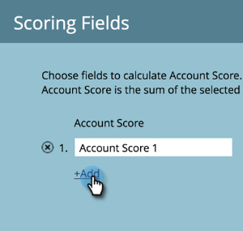

# Pontuação de contas {#account-score}

A Pontuação de conta é uma parte vital do Gerenciamento de conta do Target. Isso ajuda a determinar o nível de engajamento de suas contas.

## O que é Pontuação de conta? {#what-is-account-scoring}

É uma abordagem sistemática projetada para ajudar as equipes de vendas e marketing a identificar e priorizar as empresas (incluindo clientes potenciais) com maior probabilidade de fazer uma compra.

No mundo complexo dos processos de compra B2B, é raro que um único indivíduo tome uma decisão de compra. Muitas vezes, há várias funções envolvidas, cada uma com suas próprias necessidades. A pontuação baseada em conta leva isso em consideração, agregando as pontuações de lead de vários leads e fornecendo uma pontuação em um nível de conta.

## Exemplos comuns {#common-examples}

<table> 
 <tbody>
  <tr>
   <td><strong>Pontuação de engajamento da conta</strong></td> 
   <td>Profundidade do engajamento com base em atividades comportamentais rastreadas em vários canais (por exemplo, email, Web e anúncio) de pessoas em contas de público-alvo específicas.</td>
  </tr>
  <tr>
   <td><strong>Pontuação de juros do produto da conta</strong></td>
   <td>Pessoas de contas de destino que demonstram interesse no conteúdo de um produto específico (por exemplo, download de um white paper).</td> 
  </tr>
  <tr>
   <td><strong>Pontuação de engajamento na Web da conta</strong></td>
   <td>Pessoas de contas de destino visitando o canal da Web. A mesma pontuação pode ser criada para medir o engajamento do canal por email, anúncio ou outros canais.</td> 
  </tr>
 </tbody>
</table>

## Como configurar a pontuação da conta {#how-to-configure-account-score}

>[!NOTE]
>
>Para calcular pontuações da conta, primeiro é necessário criar pontuações de lead. O Marketo TAM agrega automaticamente pontuações de clientes potenciais às pontuações de contas. Como exemplo, pegaremos dois dos exemplos acima (_Pontuação de juros do produto da conta_ e _Pontuação de engajamento na Web da conta_).
>
>Primeiro, crie campos de pontuação de lead que capturem detalhes relevantes de cada lead de uma conta de destino.\
>Em seguida, atribua essas pontuações de lead às respectivas pontuações de conta:\
>Pontuação de Juros do Produto da Conta = SUM (Pontuação de Juros do Produto Cliente Potencial)\
>Pontuação de envolvimento da Web da conta = SUM (Pontuação de envolvimento da Web do lead)

>[!NOTE]
>
>Os usuários podem criar várias pontuações de envolvimento de conta e atribuir pontuações de pessoas diferentes a diferentes pontuações de conta.

Depois de configurar a pontuação de lead, continue seguindo as etapas abaixo.

1. Clique em **Admin**.

   

1. Clique em **Gerenciamento de conta do Target**.

   

1. Em Campos de pontuação, clique em **Editar**.

   

   >[!NOTE]
   >
   >Você pode escolher até **cinco** para calcular a Pontuação da conta.

1. Insira o nome da Pontuação da conta, clique no ícone **Selecionar pontuação de pessoa** e selecione a pontuação correspondente.

   

1. Clique em **+Adicionar** para adicionar mais pontuações.

   

1. Adicione todas as pontuações desejadas. Clique em **Salvar** quando terminar.

   
