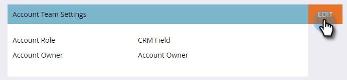

# Configuração da equipe da conta {#account-team-setup}

Uma equipe de conta é um grupo de participantes que trabalham juntos em uma conta nomeada. Siga estas etapas para escolher quais funções de conta do CRM devem ser adicionadas.

1. Clique em **Administrador**.

   

1. Clique em **Gerenciamento de Conta de Destino**.

   

1. Em Membros da equipe da conta, clique em **Editar**.

   

   >[!NOTE]
   >
   >Para Função da conta, dê um nome a ele e faça a correspondência dele com o Campo de pesquisa do usuário desejado em seu CRM.

1. Digite o nome da sua Função da conta e selecione o campo **CRM**. Adicione até 10.

   

   >[!NOTE]
   >
   >Não é possível selecionar o Proprietário da conta. Ele é escolhido por padrão no nível da conta no seu CRM.

1. Clique em **Salvar** quando terminar.

   

   >[!CAUTION]
   >
   >Se você fizer uma atualização, pode levar algum tempo para que as alterações sejam refletidas no TAM.

   >[!NOTE]
   >
   >* Quando várias contas do CRM com diferentes proprietários de conta são mescladas em uma conta nomeada, a Marketo seleciona um &quot;Proprietário da conta&quot; e adiciona outros proprietários de conta como &quot;Coproprietários da conta&quot;
   >
   >* Se um campo &quot;Função&quot; do CRM for renomeado ou excluído posteriormente, o Marketo TAM deixará de sincronizar os valores atualizados até que o usuário atualize manualmente a configuração no TAM
