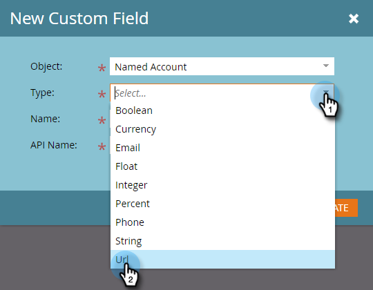

# Criar um campo personalizado para descoberta de CRM {#create-a-custom-field-for-crm-discovery}

Adicione campos personalizados a contas, mapeie-os para seu CRM e use-os para Descoberta de Conta do CRM no Marketo.

1. Clique em **[!UICONTROL Administrador]**.

   

1. Clique em **[!UICONTROL Gerenciamento de campos]**, depois em **[!UICONTROL Novo campo personalizado]**.

   

1. Clique no menu suspenso **[!UICONTROL Objeto]** e selecione **[!UICONTROL Conta Nomeada]**.

   

1. Clique no menu suspenso **[!UICONTROL Tipo]** e selecione um tipo.

   

1. Insira um **[!UICONTROL Nome]** (o Nome da API será preenchido automaticamente) e clique em **[!UICONTROL Criar]**.

   

1. Depois que o campo for criado, selecione-o na árvore à direita. Clique no menu suspenso **[!UICONTROL Ações do Campo]** e selecione **[!UICONTROL Mapear para Campo do CRM]**.

   

1. Selecione o campo de conta do CRM que você deseja mapear e clique em **[!UICONTROL Salvar]**.

   

   Depois de sincronizado, seu novo campo aparecerá na extremidade direita da grade do Discover CRM.

   
