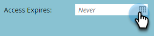
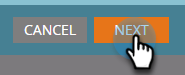
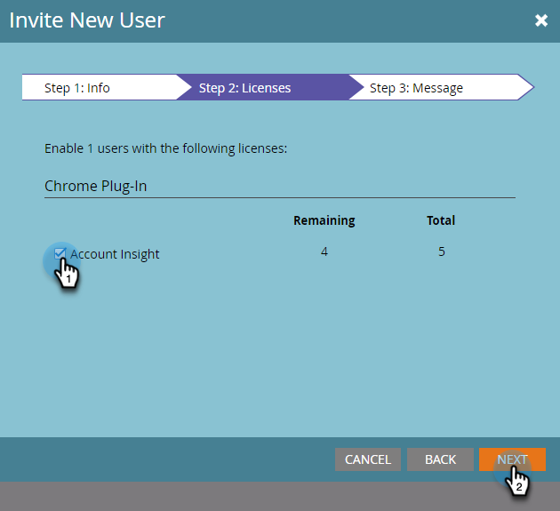

# Convidar Usuários para Acessar a [!UICONTROL Insight da Conta] {#invite-users-to-access-account-insight}

Siga estas etapas para fornecer aos usuários acesso à [!UICONTROL Insight da conta].

1. Clique em **[!UICONTROL Administrador]**.

   

1. Clique em **[!UICONTROL Usuários e funções]** na árvore. Clique na guia **[!UICONTROL Usuários de Vendas]** e **[!UICONTROL Convidar Novo Usuário de Vendas]**.

   

   Há duas maneiras de convidar usuários: pelo CRM ou por email. Neste exemplo, usaremos Convidar pelo CRM.

   >[!NOTE]
   >
   >Ao convidar novos usuários (não Marketo) por meio da lista de usuários do CRM, você pode convidar várias pessoas de cada vez. O convite por email é 1 para 1.

1. Clique no menu suspenso **[!UICONTROL Usuário do CRM]** e selecione o usuário desejado.

   

   >[!NOTE]
   >
   >Se você escolher **[!UICONTROL Convidar Usuário por email]**, basta inserir seu nome, sobrenome e endereço de email e continuar na etapa 4.

1. Para definir uma data de expiração para o acesso do usuário (opcional), clique no ícone do calendário. É definido como &quot;nunca&quot; por padrão.

   

1. Clique em **[!UICONTROL Next]**.

   

1. Marque a caixa de seleção **[!UICONTROL Conta Insight]** e clique em **[!UICONTROL Avançar]**.

   

1. Procure a mensagem enviada, faça as alterações desejadas (opcional) e clique em **[!UICONTROL Enviar]**.

   
