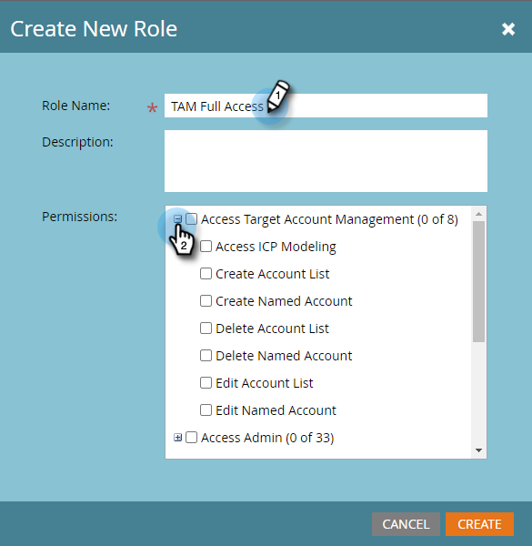

# Permissões {#permissions}

Você precisará configurar permissões para que seus usuários possam usar o TAM. Veja como.

1. Clique em **[!UICONTROL Administrador]**.

   

1. Clique em **[!UICONTROL Usuários e funções]**.

   

   >[!NOTE]
   >
   >Você pode adicionar permissões TAM para uma função existente, ou criar uma nova. Este exemplo usa uma nova função.

1. Clique em **[!UICONTROL Funções]** e depois em **[!UICONTROL Nova Função]**.

   

1. Insira um [!UICONTROL Nome da Função] e clique no ícone **+** ao lado da caixa de seleção **[!UICONTROL Acessar Gerenciamento de Conta de Destino]**.

   

1. Para selecionar _todas_ as permissões, basta marcar a caixa de seleção **[!UICONTROL Acessar Gerenciamento de Conta de Destino]**.

   

   >[!NOTE]
   >
   >Você também tem a opção de selecionar apenas algumas das opções. Faça isso marcando cada caixa de seleção individualmente.

1. Clique em **+** para abrir o menu **[!UICONTROL Acessar Administrador]**. Marque a caixa de seleção **[!UICONTROL Acessar administrador da ABM]** (ABM é o nome anterior da TAM) e clique em **[!UICONTROL Criar]**.

   

   Sua nova função TAM agora está pronta para ser [atribuída a um usuário](/help/marketo/product-docs/administration/users-and-roles/managing-user-roles-and-permissions.md#assign-roles-to-a-user)!
