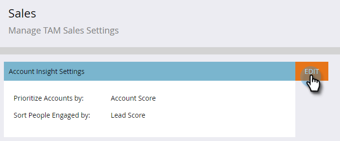

# Configurar insight da conta {#set-up-account-insight}

Veja como configurar o Account Insight.

>[!PREREQUISITES]
>
>Pontuação de conta TAM [deve ser configurada](/help/marketo/product-docs/target-account-management/setup-tam/account-score.md) primeiro.

1. Clique em **Administrador**.

   

1. Clique em **Gerenciamento de Conta de Destino** na árvore e, em seguida, na guia **Vendas**.

   

1. Clique em **Editar**.

   

1. Clique nos menus suspensos para escolher como o Account Insight prioriza contas nomeadas e pessoas envolvidas.

   

   >[!NOTE]
   >
   >Se as [configurações de Pontuação da conta](/help/marketo/product-docs/target-account-management/setup-tam/account-score.md) forem atualizadas a qualquer momento, a configuração em Vendas precisará ser atualizada por um Administrador para que as pontuações reflitam com precisão as preferências do usuário. O usuário precisa fazer logoff e logon novamente para ver as alterações.

1. Clique em **Salvar**.

   
