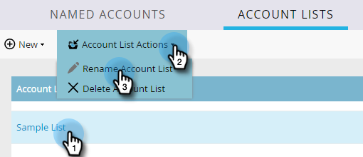

# [!UICONTROL Listas de contas] {#account-lists}

Uma lista de contas é uma coleção de contas nomeadas que podem ser segmentadas juntas. As listas de contas permitem que você direcione contas nomeadas por setor, local ou tamanho da empresa.

Além das listas de contas, você também pode criar listas de contas dinâmicas geradas de Exibições de Contas públicas do CRM. Uma Exibição de conta do CRM é um conjunto de regras que atua como filtro ao exibir contas. Por exemplo, você pode usá-lo para encontrar contas em que o setor de saúde seja *e* a receita seja superior a US$ 100 milhões.

>[!NOTE]
>
>Listas de contas criadas no [!UICONTROL Gerenciamento de Contas do Marketo] ficam disponíveis automaticamente ao criar listas inteligentes e campanhas da Web no [Web Personalization](/help/marketo/product-docs/web-personalization/using-web-segments/web-segments.md).

## Criar uma nova lista de contas {#create-a-new-account-list}

1. Clique no menu suspenso **[!UICONTROL Novo]** e selecione **[!UICONTROL Criar nova lista de contas]**.

   

1. Dê um nome à sua lista e clique em **[!UICONTROL Criar]**.

   

1. Depois de criar sua lista de contas, comece a [adicionar contas nomeadas a ela](/help/marketo/product-docs/target-account-management/target/named-accounts/add-an-existing-named-account-to-an-account-list.md)!

   >[!NOTE]
   >
   >O Marketo só exibirá insights para listas de contas com 2.000 contas nomeadas ou menos.

## Criar uma nova lista de contas dinâmicas {#create-a-new-dynamic-account-list}

1. Clique no menu suspenso **[!UICONTROL Novo]** e selecione **[!UICONTROL Criar Nova Lista Dinâmica]**.

   

1. Na caixa de diálogo, selecione uma **Exibição da Conta do CRM** no menu suspenso ou digite o nome a ser pesquisado.

   

1. Clique em **[!UICONTROL Criar]**.

   

   >[!NOTE]
   >
   >No Salesforce, certifique-se de fornecer permissões de Objeto de exibição de lista ao usuário de sincronização.

## Renomear uma lista de contas {#rename-an-account-list}

>[!NOTE]
>
>Essas etapas se aplicam somente às listas de contas. As listas de contas *Dinâmicas* usam o nome de seus Modos de Exibição de Conta do CRM associados.

1. Selecione a conta que deseja renomear, clique no menu suspenso **[!UICONTROL Ações da Lista de Contas]** e selecione **[!UICONTROL Renomear Lista de Contas]**.

   

1. Insira o novo nome e clique em **[!UICONTROL Renomear]**.

   

   >[!NOTE]
   >
   >A Exibição de conta do CRM é sincronizada com a lista de contas dinâmicas a cada 8 horas. Se ainda não estiverem sincronizados, o Marketo os sincronizará durante o próximo ciclo.

## Excluir uma lista de contas {#delete-an-account-list}

>[!NOTE]
>
>Essas etapas são as mesmas para listas de contas e listas de contas dinâmicas.

1. Selecione a conta que deseja excluir, clique no menu suspenso **[!UICONTROL Ações da Lista de Contas]** e selecione **[!UICONTROL Excluir Lista de Contas]**.

   

1. Clique em **[!UICONTROL Excluir]**.

   

>[!MORELIKETHIS]
>
>* [Adicionar uma [!UICONTROL Conta Nomeada] Existente a uma Lista de Contas](/help/marketo/product-docs/target-account-management/target/named-accounts/add-an-existing-named-account-to-an-account-list.md)
>* [Insights da lista de contas](/help/marketo/product-docs/target-account-management/measure/account-list-insights.md)
