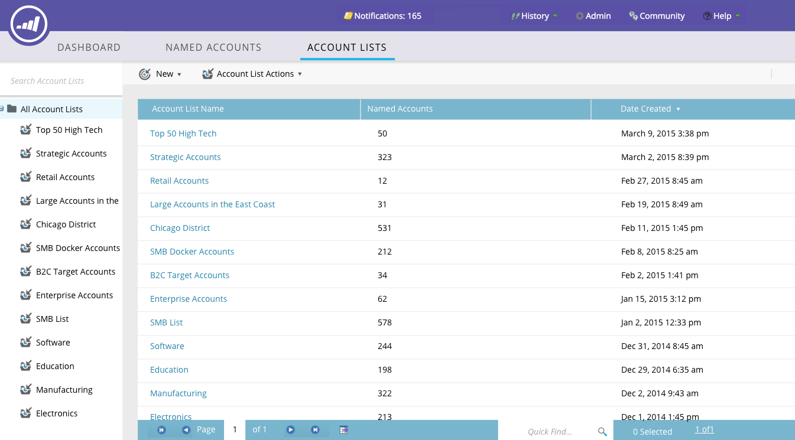
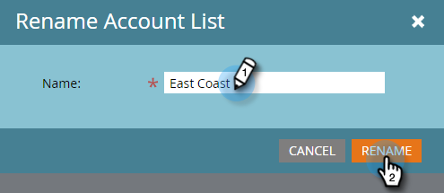

# Listas de contas {#account-lists}

Uma lista de contas é uma coleção de contas nomeadas que podem ser direcionadas juntas. As listas de contas permitem direcionar contas nomeadas por setor, local ou tamanho da empresa.

Além das listas de conta, você também pode criar listas de conta dinâmicas que são geradas a partir de Exibições de conta CRM públicas. Uma Exibição de conta do CRM é um conjunto de regras que atua como um filtro ao exibir contas. Por exemplo, você pode usá-lo para encontrar contas em que Setor é Saúde *e* Receita acima de $100M.

>[!NOTE]
>
>As listas de contas criadas no Gerenciamento de conta do Marketo Target ficam automaticamente disponíveis ao criar listas inteligentes e campanhas da Web em [Personalização da Web](/help/marketo/product-docs/web-personalization/using-web-segments/web-segments.md).

## Criar uma nova lista de contas {#create-a-new-account-list}

1. Clique no menu suspenso **New** e selecione **Create New Account List**.

   

1. Dê um nome à lista e clique em **Criar**.

   

1. Depois de criar a lista de contas, comece em [adicionar contas nomeadas a ela](/help/marketo/product-docs/target-account-management/target/named-accounts/add-an-existing-named-account-to-an-account-list.md)!

   >[!NOTE]
   >
   >O Marketo só exibirá insights de listas de contas com 2.000 ou menos contas nomeadas.

## Criar uma nova lista de conta dinâmica {#create-a-new-dynamic-account-list}

1. Clique no menu suspenso **New** e selecione **Create New Dynamic List**.

   

1. Na caixa de diálogo, selecione uma **Exibição da conta CRM** no menu suspenso ou digite o nome para pesquisá-la.

   

1. Clique em **Criar**.

   

   >[!NOTE]
   >
   >No Salesforce, certifique-se de fornecer permissões de Objeto de Exibição de Lista ao usuário de sincronização.

## Renomear uma Lista de Contas {#rename-an-account-list}

>[!NOTE]
>
>Essas etapas se aplicam somente às listas de contas. __ As listas de contas dinâmicas usam o nome de suas Exibições de conta do CRM associadas.

1. Selecione a conta que deseja renomear, clique no menu suspenso **Ações da Lista de Contas** e selecione **Renomear Lista de Contas**.

   

1. Insira o novo nome e clique em **Renomear**.

   

   >[!NOTE]
   >
   >A Exibição de conta do CRM sincroniza com a lista de conta dinâmica a cada 8 horas. Se ainda não estiverem sincronizados, o Marketo os sincronizará durante o próximo ciclo.

## Excluir uma Lista de Contas {#delete-an-account-list}

>[!NOTE]
>
>Essas etapas são as mesmas para listas de conta e listas de conta dinâmica.

1. Selecione a conta que deseja excluir, clique no menu suspenso **Ações da Lista de Contas** e selecione **Excluir Lista de Contas**.

   

1. Clique em **Excluir**.

   

>[!MORELIKETHIS]
>
>* [Adicionar uma conta nomeada existente a uma lista de contas](/help/marketo/product-docs/target-account-management/target/named-accounts/add-an-existing-named-account-to-an-account-list.md)
>* [Insights da lista de contas](/help/marketo/product-docs/target-account-management/measure/account-list-insights.md)

