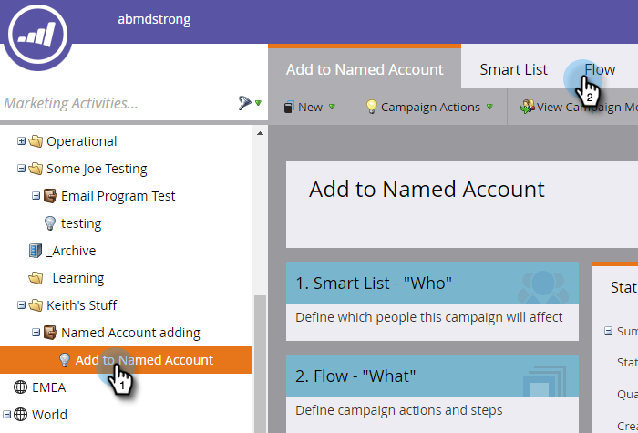
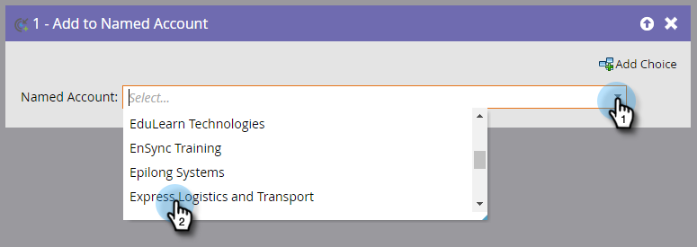
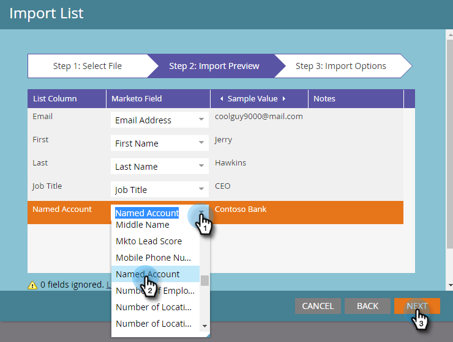
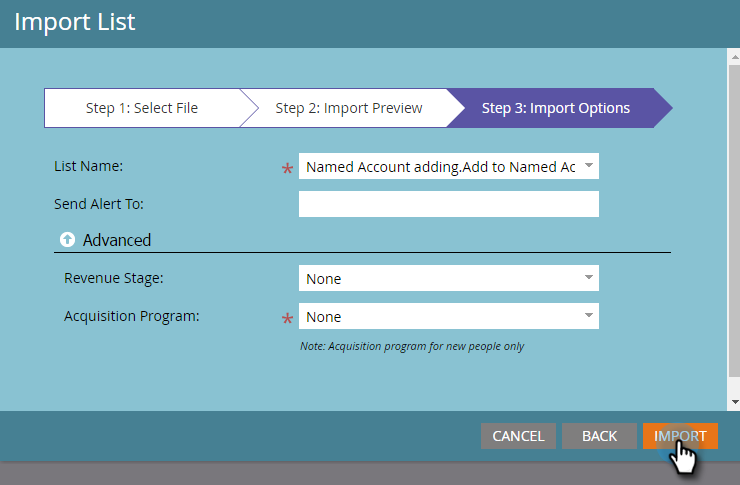

# Adicionar pessoas a uma [!UICONTROL Conta nomeada] {#add-people-to-a-named-account}

Há três maneiras diferentes de adicionar pessoas manualmente a uma conta nomeada no TAM.

## Ação de fluxo único {#single-flow-action}

1. Clique em **[!UICONTROL Banco de Dados]**.

   

1. Insira o endereço de email da pessoa e pressione Enter.

   

1. Clique na pessoa para selecioná-la. Clique no menu suspenso **[!UICONTROL Ações da Pessoa]**, clique em **[!UICONTROL Marketing]** e selecione **[!UICONTROL Adicionar à Conta Nomeada...]**.

   

1. Clique no menu suspenso **[!UICONTROL Conta Nomeada]**, selecione a [!UICONTROL Conta Nomeada] desejada e clique em **[!UICONTROL Executar Agora]**.

   

## Etapa de fluxo de campanha inteligente {#smart-campaign-flow-step}

1. Selecione sua Campanha inteligente e clique em **[!UICONTROL Fluxo]**.

   

1. Na caixa de pesquisa, digite &quot;[!UICONTROL Adicionar à Conta Nomeada].&quot;

   

1. Arraste o filtro até a tela de desenho.

   

1. Clique no menu suspenso **[!UICONTROL Conta nomeada]** e selecione a [!UICONTROL Conta nomeada] desejada.

   

   Em seguida, agende (ou ative) sua campanha inteligente e a etapa de fluxo começará a adicionar pessoas qualificadas à conta nomeada designada.

## Importação de lista {#list-import}

1. Selecione sua lista, clique no menu suspenso **[!UICONTROL Ações de Lista]** e selecione **[!UICONTROL Importar Lista]**.

   

1. Depois de escolher o arquivo e as configurações, clique em **[!UICONTROL Avançar]**.

   

1. Mapeie os campos desejados. Verifique se o campo **[!UICONTROL Conta Nomeada]** está mapeado.

   

1. Escolha as configurações desejadas e clique em **[!UICONTROL Importar]**.

   

>[!MORELIKETHIS]
>
>[Lead para Correspondência de Conta](/help/marketo/product-docs/target-account-management/target/named-accounts/lead-to-account-matching.md)
