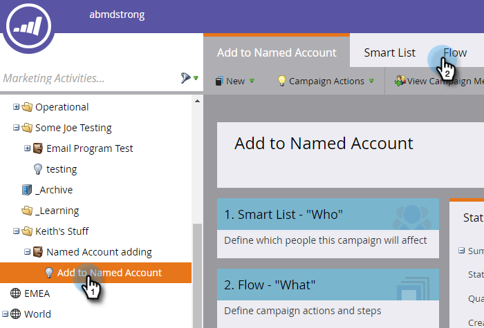
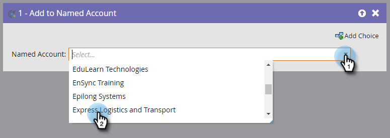
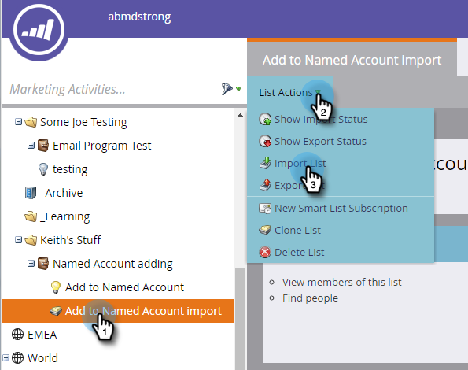

# Adicionar pessoas a uma conta nomeada {#add-people-to-a-named-account}

Há três maneiras diferentes de adicionar manualmente pessoas a uma conta nomeada no ABM.

## Ação de fluxo único {#single-flow-action}

1. Clique em **Banco de Dados**.

   

1. Insira o endereço de email da pessoa e pressione enter.

   

1. Clique na pessoa para selecioná-la. Clique no menu suspenso **Ações de pessoa**, clique em **Marketing** e selecione **Adicionar à conta nomeada**.

   

1. Clique no menu suspenso **Conta Nomeada**, selecione a Conta Nomeada desejada e clique em **Executar Agora**.

   

## Etapa de fluxo de campanha inteligente {#smart-campaign-flow-step}

1. Selecione sua Campanha inteligente e clique em **Fluxo**.

   

1. Na caixa de pesquisa, digite &quot;Adicionar à conta nomeada&quot;.

   

1. Arraste o filtro para a tela.

   

1. Clique no menu suspenso **Conta nomeada** e selecione a Conta Nomeada desejada.

   

   Pronto! Em seguida, agende (ou ative) sua campanha inteligente e a etapa de fluxo começará a adicionar pessoas qualificadas à conta nomeada designada.

## Importar Lista {#list-import}

1. Selecione a lista, clique no menu suspenso **List Actions** e selecione **Import List**.

   

1. Depois de escolher seu arquivo e configurações, clique em **Next**.

   

1. Mapeie os campos desejados. Certifique-se de que o campo **Conta Nomeada** esteja mapeado.

   

1. Escolha as configurações desejadas e clique em **Importar**.

   

>[!MORELIKETHIS]
>
>[Lead para a correspondência da conta](/help/marketo/product-docs/target-account-management/target/named-accounts/lead-to-account-matching.md)
