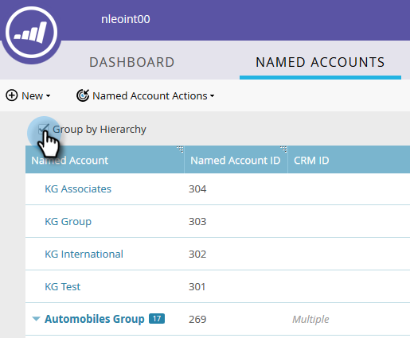
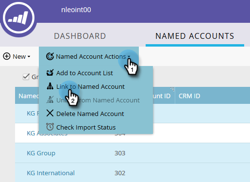
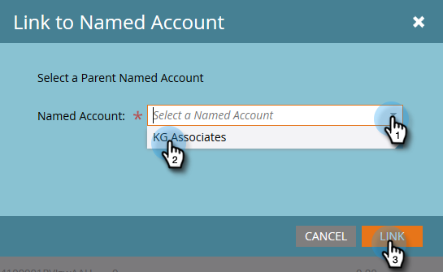

# Criar uma hierarquia {#create-a-hierarchy}

As hierarquias devem ser criadas em CRMs. No entanto, se você não tiver um CRM, siga estas etapas para criar uma hierarquia manualmente.

1. Em [!UICONTROL Contas Nomeadas], clique na caixa de seleção **[!UICONTROL Agrupar por Hierarquia]**.

   

   >[!NOTE]
   >
   >Somente contas que não sejam do CRM podem ser usadas para criar uma hierarquia manualmente. As contas vinculadas ao CRM precisam ter suas hierarquias criadas no CRM.

1. Usando ctrl+clique (Windows) ou Cmd+clique (Mac), selecione todas as contas que deseja agrupar em uma hierarquia.

   

1. Clique no menu suspenso **[!UICONTROL Ações da Conta Nomeada]** e selecione **[!UICONTROL Vincular à Conta Nomeada]**.

   

   >[!NOTE]
   >
   >Se quiser desvincular contas, siga as etapas acima, mas escolha **[!UICONTROL Desvincular da conta nomeada]**.

1. Selecione uma Conta nomeada pai no menu suspenso e clique em **[!UICONTROL Link]**.

   

1. Suas contas nomeadas agora fazem parte de uma hierarquia. Clique na seta à esquerda para ver todas as contas de filhos.

   
