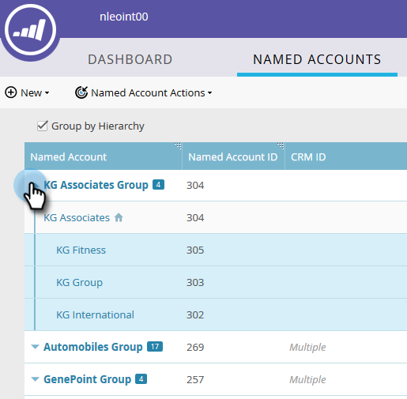

# Criar uma hierarquia {#create-a-hierarchy}

Hierarquias devem ser criadas em CRMs. No entanto, se você não tiver um CRM, siga estas etapas para criar uma hierarquia manualmente.

1. Em Contas Nomeadas, clique no botão **Agrupar por Hierarquia** caixa de seleção.

   

   >[!NOTE]
   >
   >Somente contas que não sejam CRM podem ser usadas para criar manualmente uma hierarquia. As contas vinculadas ao CRM precisam ter suas hierarquias criadas no CRM.

1. Usando ctrl+clique (Windows) ou Cmd+clique (Mac), selecione todas as contas que deseja agrupar em uma hierarquia.

   

1. Clique no botão **Ações de conta nomeada** e selecione **Vincular à conta nomeada**.

   

   >[!NOTE]
   >
   >Se quiser desvincular contas, siga as etapas acima, mas escolha **Desvincular da conta nomeada**.

1. Selecione uma Conta Nomeada Pai no menu suspenso e clique em **Link**.

   

1. Suas contas nomeadas agora fazem parte de uma hierarquia. Clique na seta à esquerda para ver todas as contas-filho.

   
