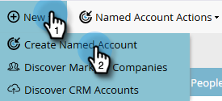

# Criar uma [!UICONTROL Conta nomeada] {#create-a-named-account}

Siga estas etapas para criar manualmente uma conta nomeada.

1. Em [!UICONTROL Contas Nomeadas], clique no menu suspenso **[!UICONTROL Novas]** e selecione **[!UICONTROL Criar Conta Nomeada]**.

   

1. Preencha os campos desejados e clique em **[!UICONTROL Criar]**.

   

   >[!TIP]
   >
   >Clique diretamente em uma conta nomeada para ver seu painel.

>[!MORELIKETHIS]
>
>[Adicionar Pessoas a uma [!UICONTROL Conta Nomeada]](/help/marketo/product-docs/target-account-management/target/named-accounts/add-people-to-a-named-account.md)
