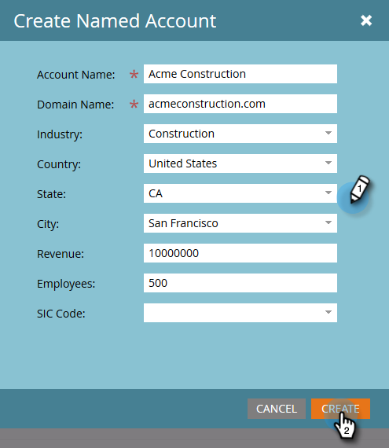

# Criar uma conta nomeada {#create-a-named-account}

Siga estas etapas para criar manualmente uma conta nomeada.

1. Em Contas Nomeadas, clique no menu suspenso **Novo** e selecione **Criar Conta Nomeada**.

   

1. Preencha os campos desejados e clique em **Criar**.

   

   >[!TIP]
   >
   >Clique diretamente em uma conta nomeada para ver seu painel.

>[!MORELIKETHIS]
>
>[Adicionar Pessoas a uma Conta Nomeada](/help/marketo/product-docs/target-account-management/target/named-accounts/add-people-to-a-named-account.md)
