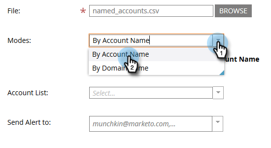

# Importar contas nomeadas {#import-named-accounts}

Já tem um CSV cheio de contas de destino em potencial? Importe-os diretamente para o TAM!

1. Clique no menu suspenso **Novo** e selecione **Importar contas nomeadas**.

   

1. Uma nova janela será aberta. Clique em **Procurar** e selecione o arquivo de contas nomeadas que deseja importar.

   

   >[!TIP]
   >
   >Em seu arquivo, forneça [o máximo de informações](/help/marketo/product-docs/target-account-management/target/named-accounts/named-account-overview.md#named-account-attributes) possível. Você só pode adicionar informações firmográficas; nada que o Marketo calcule (ou seja, Pipeline). Para criar contas nomeadas com base em contas do CRM, basta exportar o nome da conta e a ID do CRM do seu CRM para um arquivo CSV, usar a opção Nome da conta e mapear a ID do CRM durante o processo de importação. Para vincular corretamente uma conta do CRM a uma conta nomeada, você deve fornecer o nome exato da conta do CRM.

1. Escolha entre dois modos de desduplicação: Nome da conta ou Nome do domínio. Neste exemplo, vamos escolher Conta. Clique no menu suspenso **Modos** e selecione **Por nome de conta**.

   

   >[!NOTE]
   >
   >Se você escolher **Por Modo de Domínio**, os campos de conta nomeada e de domínio deverão ser incluídos.

1. Para escolher a qual lista de contas sua conta nomeada será adicionada, clique no menu suspenso **Lista de Contas** e faça sua seleção.

   

   >[!NOTE]
   >
   >Você também pode criar uma nova Lista de contas simplesmente digitando seu nome na caixa suspensa.

1. Para enviar uma notificação sobre a importação, clique no menu suspenso **Enviar Alerta para** e selecione um usuário do Marketo. Você _não pode_ inserir um endereço de email manualmente.

   

1. Clique em **Avançar**.

   

1. Mapeie cada campo clicando duas vezes no menu suspenso **Campo do Marketo** e selecionando o campo apropriado. Clique em **Avançar** quando terminar.

   

   Sucesso!

   

   >[!NOTE]
   >
   >&quot;Verificar status da importação&quot; mostra apenas os últimos três dias de atividade.

Cenários em que você realiza a desduplicação por Nome da Conta:

<table> 
 <tbody> 
  <tr> 
   <td><strong>Importando registro com nome de Conta Nomeada existente</strong></td> 
   <td>
Atualizaremos o registro existente
</td> 
  </tr> 
  <tr> 
   <td><strong>Importando registro com o novo nome de Conta Nomeada</strong></td> 
   <td>Criaremos um novo registro</td> 
  </tr> 
 </tbody> 
</table>

Cenários em que você realiza a desduplicação por Nome de domínio:

<table> 
 <tbody> 
  <tr> 
   <td><strong>Importando registro com um novo nome de conta e um novo nome de domínio</strong></td> 
   <td>Criaremos uma nova conta nomeada com as informações fornecidas</td> 
  </tr> 
  <tr> 
   <td><strong>Importação de registro com um nome de conta existente e um nome de domínio existente</strong></td> 
   <td>Atualizaremos a conta nomeada existente</td> 
  </tr> 
   <tr> 
   <td><strong>Importação de registro com um novo nome de conta e nome de domínio existente</strong></td> 
   <td>Anexaremos o novo nome de conta à conta nomeada existente que corresponde ao nome do domínio e atualizaremos outras informações (por exemplo, Setor, Estado etc)</td> 
  </tr> 
  <tr> 
   <td><strong>Importando registro com nome de Conta Nomeada existente e novo nome de domínio</strong></td> 
   <td>Anexaremos o novo nome de domínio à conta nomeada existente que corresponde ao nome da conta e atualizaremos outras informações (por exemplo, Setor, Estado etc)</td> 
  </tr> 
 </tbody> 
</table>

>[!NOTE]
>
>Quando o Marketo anexa uma conta nomeada, estamos atualizando uma regra (nos bastidores) que nos permite identificar as pessoas que devem fazer parte da Conta nomeada. Exemplo: se você atualizar &quot;IBM&quot; para &quot;IBM, EUA&quot;, as pessoas com qualquer nome de empresa serão associadas à Conta nomeada.

Se o Marketo encontrar registros que vemos como duplicatas, processaremos apenas o primeiro.
