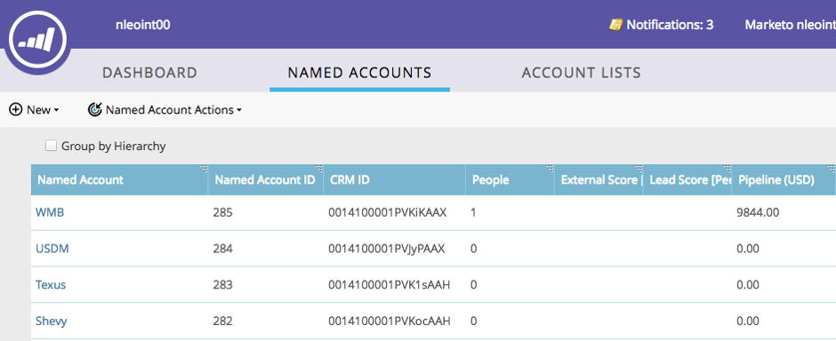

# Hierarquias de TAM {#tam-hierarchies}

As hierarquias dão aos usuários de TAM a capacidade de herdar as relações pai/filho entre [!UICONTROL Contas nomeadas] em seus CRMs.

## O que são hierarquias de TAM? {#what-are-tam-hierarchies}

As empresas podem ter várias divisões e subsidiárias. Essas empresas geralmente se organizam por meio de relações pai-filho chamadas hierarquias. O TAM pode herdar essas hierarquias da integração do SFDC ou do MSD e permitir que você trabalhe com as diferentes divisões como uma única família.

## Trabalhar com hierarquias TAM {#working-with-tam-hierarchies}

Com Hierarquias TAM, você pode obter rapidamente informações sobre uma hierarquia inteira ou contas individuais no painel [!UICONTROL Conta nomeada].

**Hierarquia Não Usada**

**Usando Hierarquia**

>[!NOTE]
>
>A interface do Marketo só será exibida até 10 níveis abaixo (contas de filhos e netos da conta principal). No entanto, não há limite para o número de contas de filhos que você pode criar.

Direcione e relate hierarquias inteiras com [um clique](/help/marketo/product-docs/target-account-management/engage/account-filters.md#member-of-named-account).

