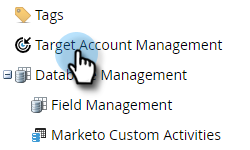
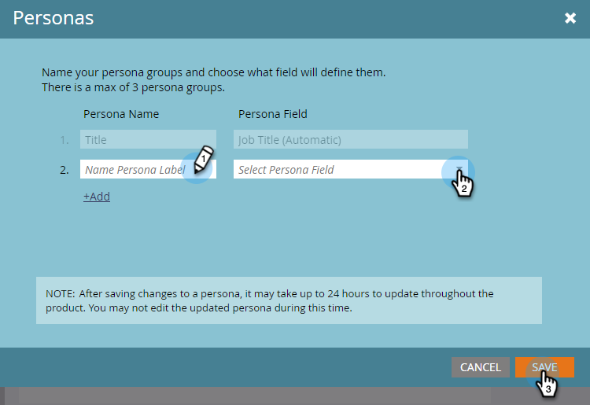
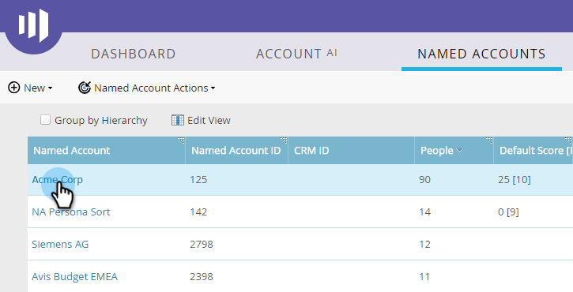

# Uso de personas {#using-personas}

As personas são uma ótima maneira de segmentar o público e o mercado da ABM para um subconjunto específico de pessoas.

## Adicionar uma persona {#add-a-persona}

1. Em Minha Marketo, clique em **[!UICONTROL Administrador]**.

   

1. Na árvore, selecione **[!UICONTROL Gerenciamento de Conta de Destino]**.

   

1. Clique em **[!UICONTROL Editar]**.

   

   >[!NOTE]
   >
   >O perfil Cargo é incluído por padrão. Não é possível modificá-lo ou excluí-lo.

1. Para adicionar outros perfis, clique em **[!UICONTROL +Adicionar]**.

   

1. Dê um nome à persona e selecione o campo correspondente no menu suspenso. Você pode adicionar até dois perfis adicionais. Clique em **[!UICONTROL Salvar]** quando terminar.

   

   >[!NOTE]
   >
   >Somente os campos personalizados do Salesforce do tipo &quot;lista de opções&quot; que foram sincronizados com sua instância do Marketo estão disponíveis no menu suspenso de campos de persona ao criar uma persona.

## Exibir suas personalidades {#view-your-personas}

Exiba seus perfis visitando uma [!UICONTROL Conta Nomeada] específica.

1. Selecione a [!UICONTROL Conta nomeada] desejada.

   

1. Clique na guia **[!UICONTROL Personas]**.

   

1. Todos os seus perfis estão listados. Clique em um número para ver a lista de pessoas.

   

   >[!NOTE]
   >
   >O X na [!UICONTROL Pessoa de Título] atua como um caractere curinga. Por exemplo, &quot;CXO&quot; incluirá CEOs, CFOs etc.

## Filtros pessoais {#persona-filters}

1. Use filtros de persona em uma lista inteligente para vender para um grupo específico de pessoas.

