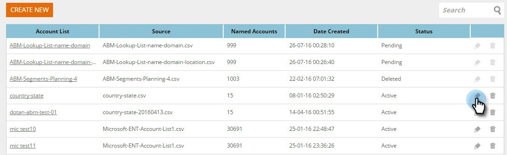

# Criar uma nova Lista de conta {#create-a-new-account-list}

Crie e carregue uma lista de nomes de organizações e domínios para público alvo dessas contas principais com campanhas personalizadas.

>[!NOTE]
>
>Este artigo aplica-se somente aos clientes Web ABM herdados. Se você adquiriu o Web ABM após setembro de 2016, siga as etapas [deste artigo](http://docs.marketo.com/display/DOCS/Account+Lists#AccountLists-CreateaNewAccountList) .

## Criar uma nova Lista de conta {#create-a-new-account-list-1}

1. Vá para Listas **de conta**.

   

1. Selecione **Criar novo**.

   

1. Selecione **Procurar** e carregue seu arquivo CSV (verifique se o arquivo csv atende aos critérios). Adicione um **Nome** e uma **Descrição**. Clique em **Salvar**.

   

   >[!NOTE]
   >
   >**Qual é o formato do arquivo CSV?**
   >
   >
   >Verifique se o arquivo CSV de conta nomeado atende aos seguintes requisitos:
   >
   >* Salvo como um formato CSV
   >* Não excede 10 MB
   >* Apenas 4 colunas com o cabeçalho Coluna A: Nome, Coluna B: Domínio, Coluna C: País, Coluna D: Estado dos EUA.
   >* O arquivo carregado pode levar até 2 dias úteis antes da aprovação.
   >* Você receberá uma notificação por email de aprovação ou verificará o estado do arquivo na página Contas Nomeadas.
   >* O número total de registros/linhas acumulados para todas as suas listas carregadas a 10K, com o maior pacote a totalizar 100K.

   >[!NOTE]
   >
   >**Exemplo**
   >
   >**Exemplo do arquivo CSV**
   >
   >* Linha 1 Coluna A valor = Organização
   >* Linha 1 Valor da coluna B = Domínio
   >* Linha 1 Valor da coluna C = País
   >* Linha 1 Valor da coluna D = Estado dos EUA
   >* Um dos valores de coluna é obrigatório. No entanto, fornecer nomes de Organização e Domínio melhora as taxas de correspondência da Lista Conta.
   >* País e Estado são valores opcionais.

      >
      >  
   * Para o nome do país, use o nome completo do país ou o código de abreviação. Eg. Estados Unidos ou EUA.
   >  * Para um Estado dos EUA, use o código de abreviação de duas letras, isto é, CA. Somente os estados dos EUA são reconhecidos.

   >    
   >

## Editar uma Lista de conta {#edit-an-account-list}

Na página Listas **da** conta, clique no ícone **Editar **na lista.

Selecione **Procurar** e carregue seu novo arquivo CSV. Este arquivo substituirá o arquivo original. Clique em **Salvar**. O novo arquivo carregado estará em um estado pendente até ser aprovado pelo suporte do Marketo, quando em um estado pendente o arquivo original permanecerá ativo.

O arquivo CSV substituirá o arquivo existente. A lista existente permanecerá ativa até que o processamento do novo arquivo seja concluído.

## Excluir uma Lista de conta nomeada {#delete-a-named-account-list}

1. Na página **Listas da conta **clique no **ícone **Excluir **lista que você deseja excluir.

   

1. Uma mensagem é exibida para confirmar se você deseja excluir a lista. Clique em **OK**.

   

>[!NOTE]
>
>**Artigos relacionados**
>
>* [Criar um segmento usando uma Lista de conta](create-a-segment-using-an-account-list.md)
>* [Visualização de uma Lista de conta nomeada](http://docs.marketo.com/pages/viewpage.action?pageid=4720244)

