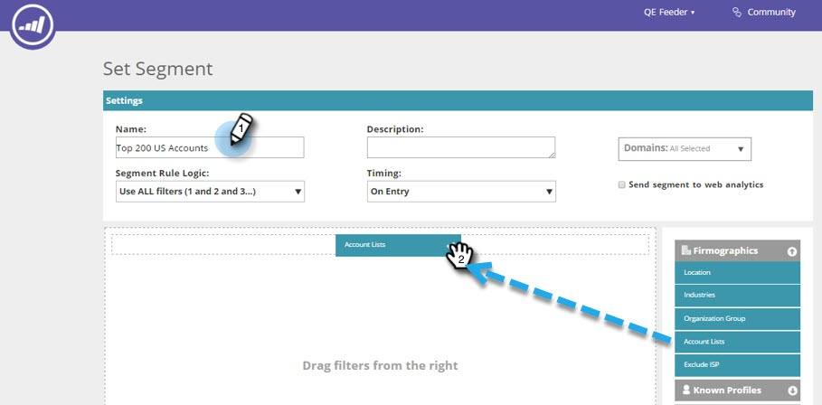

# Criar um segmento usando uma lista de contas {#create-a-segment-using-an-account-list}

Veja como criar um segmento usando uma Lista de contas.

>[!PREREQUISITES]
>
>[Criar uma Nova Lista de Contas](/help/marketo/product-docs/target-account-management/target/account-lists.md)

1. Vá para **Segmentos**.

   

1. Clique em **Criar novo**.

   

1. Insira um nome para o segmento. Arraste e solte **Listas de Contas** da seção **Firmographics**.

   

1. Selecione uma Lista de contas na lista de contas nomeadas que você carregou. O número entre parênteses ao lado do Nome da lista da conta é a ID da lista para referência da API.

   

   >[!NOTE]
   >
   >As listas de contas são sincronizadas do ABM para o Web Personalization para uso na segmentação. Selecione-os no menu suspenso. A sincronização pode levar até cinco minutos. Ele só será sincronizado se houver uma ou mais contas nomeadas na lista de contas.

1. Clique em **Salvar** ou em **Salvar e definir a campanha** para ir para a página Campanhas.

   

Parabéns! Agora você configurou um segmento que direciona uma Lista de contas.
