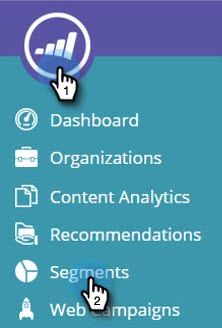

# Criar um segmento usando uma Lista de conta {#create-a-segment-using-an-account-list}

Veja como criar um segmento usando uma Lista de conta.

>[!PREREQUISITES]
>
>* [Criar uma nova Lista de conta](../../../product-docs/account-based-marketing/target/account-lists.md)

>

1. Ir para **Segmentos**.

   

1. Clique em **Criar novo**.

   

1. Insira um nome para o segmento. Arraste e solte Listas **de** conta na seção **Firmográficos** .

   

1. Selecione uma Lista de conta na lista das contas nomeadas que você carregou. O número entre colchetes ao lado do Nome da Lista da conta é a ID da Lista para referência da API.

   

   >[!NOTE]
   >
   >As Listas de conta são sincronizadas de ABM para Web Personalization para uso em Segmentação. Selecione-os no menu suspenso. A sincronização pode levar até cinco minutos. Ela só será sincronizada se houver uma ou mais contas nomeadas na Lista Conta.

1. Clique em **Salvar** ou em **Salvar e definir Campanha** para ir para a página Campanhas.\
   

Parabéns! Agora você configura um segmento direcionado a uma Lista de conta.
